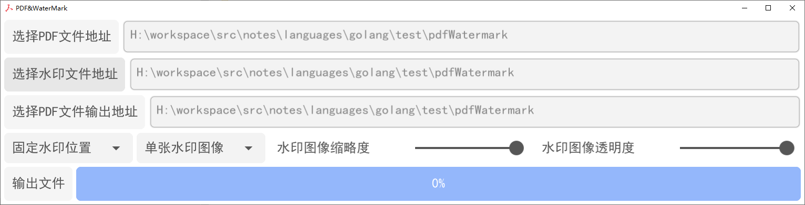

### pdfWatermark

- 编译 windows 软件

    ```
        fyne package -os windows -icon ./images/pdf.jpg -name pdf-water
    ```


- 程序样式

    
    

- 字段说明  

    ```
      操作页面参数值说明
      选择PDF文件地址：需要添加水印的原始PDF文件位置
      选择水印文件地址：给PDF添加的水印文件位置
      选择PDF文件输出地址：加完水印生成的PDF文件存放位置

      固定水印位置/随机水印位置：是否对水印位置进行随机
      单张水印图像/多张水印图像: 单页PDF是否设置多张水印

      水印图像缩略度：如果水印图像过大，可滑动设置图像缩略
      水印图像透明度：可滑动设置图像透明度

      输出文件：点击即进行PDF添加水印操作
      
          
    ```

#### 2. 操作步骤

- 1. 设置筛选摘要信息

     1. 设置相应参数

     2. 点击生成水印PDF

#### 3. 效果图展示
- 
    - 单张
    
    
    
    - 多张&随机位置
    
    
    
    - 缩略度
    
    
    
    - 透明度
    
    


