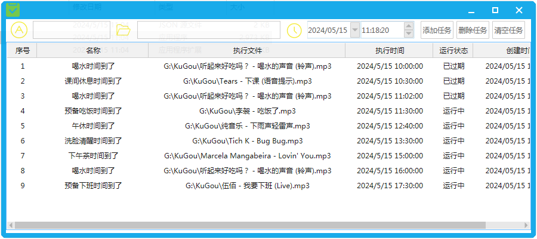

#### 声音播放任务

```
    声音播放任务
    1. 可指定时间播放
    2. 可指定播放内容（支持.mp3  .wav）
    3. 支持配置导入
        {
            "task" :[
                {
                    {
                        "name": "喝水时间到了", // 任务名称
                        "filename": "G:\\KuGou\\听起来好吃吗？ - 喝水的声音 (铃声).mp3", // 任务播放文件
                        "time": "10:00" // 任务执行时间 24小时制 小时:分钟
                    },
                }
            ]
        }

    ps: 随即弹窗、锁屏 ... 待加入    
```
- app 应用页面
    
