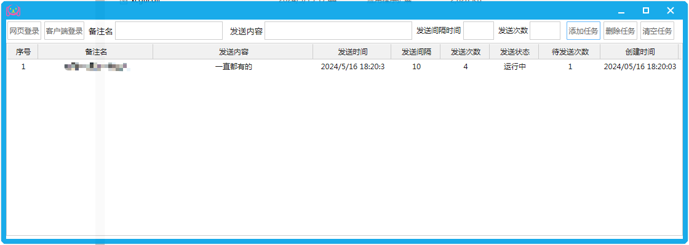

#### 定时推送微信消息

```
    软件用于定时循环催进度发消息,使用过程中会有很多局限性，譬如大部分只能桌面登录，不能网页登陆，电脑登录和任务只能执行一个，如果任务能够获取电脑端登录的信息就很完美。
```

- 程序开发的步骤
  - gui 按钮 svg 及 模块定义
  - openwechat 包热登录、用户获取及消息推送测试
  - 推送消息任务队列封装 测试
  - 按钮操作、数据展示、状态刷新及整合
- 实际应用界面
    
