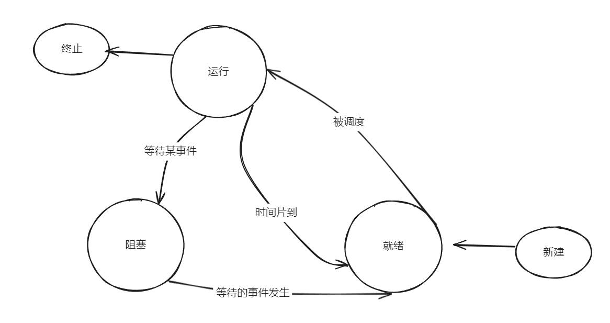
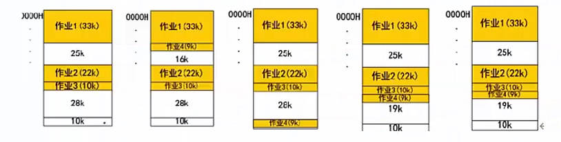

v2 记录

# 目录

## PDF

## Mp4

## 练习题

- 8/108 页码

[开始学习直播](#开始学习直播)

[开始学习录播](#开始学习录播)

- [11计算机硬件-cpu-校验码](#11计算机硬件-cpu-校验码)

- [12指令系统-存储系统-cache](#12指令系统-存储系统-cache)

----

### 开始学习直播

#### 00_1_24年5月直播课_更新中_考前复习看 > 01 .架构专题1.导学-选择题串讲1-24年5月

    ```
    先学习录播
    分层级结构学习，对于不重要内容可跳过
    重点 架构（八大架构）+ 构建 + 网络编程
    ```

### 开始学习录播

#### 01.新大纲_基础精讲新课_第二版

##### 1.1计算机硬件-CPU-校验码

- 计算机 运算器、控制器、存储器、输入设备和输出设备五大部件
- CPU（运算器 + 控制器）、存储器（内部存储 + 外部存储）、外设（输入设备 + 输出设备）
- CPU （运算器、控制器、寄存器组、内部总线 等部件）
- 运算器
  - 算术逻辑单元（ALU）实现对数据的算术和逻辑运算
  - 累加寄存器（AC）运算结果或源操作数的存放区
  - 数据缓冲寄存器（DR）暂时存放内存的指令或数据
  - 状态条件寄存器（SPW）保存指令运行结果的条件码内容
- 控制器
  - 指令寄存器（IR）暂存CPU执行指令
  - 程序计数器（PC）存放指令执行地址
  - 地址寄存器（AR）保存当前CPU所访问的内存地址
  - 指令译码器（ID）分析指令操作码
- CPU 依据 指令周期的不同阶段 来区分二进制的指令和数据
- 码距：在两个编码中，从一个编码到另一个编码所需要改变的位数 称为 码距。
- 奇偶校验码
  - 增加一位校验码来使编码中1的个数为奇数或者偶数。
  - 奇偶校验码 只能校验一位，不能纠错。
- CRC 校验码
  - 只能校验，不能纠错。
  - 需要先约定一个多项式(G(x)=x^5+x^2+x+1)，根据最高阶数 进行原始信息补零，根据多项式求得除数，除数 使用 模二 除法运算（不进位，不借位），求得余数。
  - 余数不足最高阶数，则余数左边用 若干零 补齐。

##### 1.2指令系统-存储系统-cache

- 指令系统
  - 指令的组成： 操作码 + 操作数
  - 操作码： 指明要完成的操作
  - 操作数： 指明参加运算的数据及其所在的单元地址
- 计算机指令执行过程
  - 取指令： 取出程序计数器PC中的指令地址
  - 分析指令：指令译码器进行分析，分析指令操作码
  - 执行指令： 执行指令，取出指令执行所需的源操作数  
- 指令寻址方式：
  - 顺序寻址方式： 一条接着一条指令 顺序执行
  - 跳跃寻址方式： 不是由程序计数器给出，而是由本条指令给出
- 指令操作数的寻址方式
  - 立即寻址方式： 指令的地址码字段指出的不是地址，而是操作数本身
  - 直接寻址方式： 在指令的地址字段中直接指出操作数在主存中的地址
  - 间接寻址方式： 指令地址码字段指向的存储单元中存储的是操作数的地址
  - 寄存器寻址方式： 指令中的地址码是寄存器的编号
- CISC 是复杂指令系统，兼容性强，指令繁多，长度可变，由微程序实现
- RISC 是精简指令系统，指令少，使用频率接近，主要依靠硬件实现（通用寄存器、硬布线逻辑控制）
- 指令流水线原理： 将指令分成不同段，每段由不同的部分去处理
- RISC 的流水线技术：
  - 超流水线技术： 细水长流，以时间换空间。
  - 超标量技术： 内装多条流水线，以空间换时间。
  - 超长指令字技术： 充分发挥软件的作用
- 流水线时间计算
  - 流水线周期： 指令分成不同执行段，其中执行时间最长的段为流水线周期
  - 流水线执行时间： 1条指令总执行时间+（总指令条数-1）*流水线周期
  - 流水线吞吐率计算： 指令条数/流水线执行时间
  - 流水线加速比计算： 不使用流水线执行时间/使用流水线执行时间
- 计算机采用分级存储体系的主要目的是为了解决存储容量、成本和速度之间的矛盾问题。
- 两级存储： Cache-主存、主存-辅存（虚拟存储体系）。
- 局部性原理：
  - 时间局部性：相邻的时间里会再次访问同一个数据项。
  - 空间局部性： 相邻的空间地址会被连续访问。
- 高速缓存Cache用来存储当前最活跃的程序和数据，直接与CPU交互。
- Cache 由控制部分和存储器组成。
- 地址映射：在CPU工作时，送出的是主存单元的地址，而应从Cache存储器中读/取信息。
  - 直接映射：Cache的每一个存储单元对应主存中的一个存储单元
  - 全相连映射： Cache的每一个存储单元对应主存中的多个存储单元
  - 组组相连映射： Cache的每一个组对应多个存储单元，组对应主存中的组概念
- 替换算法：当Cache已满，需要进行替换时，采用不同替换算法，使Cache 获得尽可能高的命中率。
  - 随机替换算法： 随机选择一个Cache块进行替换。
  - 先进先出算法： 按照顺序进行替换。
  - 近期最少使用算法： 选择近期最少使用的Cache块进行替换。
  - 优化替换算法： 需要先执行一次，更具统计情况 进行替换。
- 命中率及平均时间
  - 概念： 当CPU访问问的数据在Cache中时，成为Cache命中，直接从Cache中取出数据。
  - 平均访问时间 = 命中Cache概率 + 主存访问时间*（1-命中Cache概率）

##### 1.3磁盘-输入输出技术-总线

- 磁盘有正反两个盘面，每个盘面有多个同心圆，每个同心圆是一个磁道，每个同心圆又被划分为多个扇区，数据就被存放在一个个扇区中。
- 磁头 首先要寻找到对应的磁道，然后等待磁盘进行周期旋转，旋转到制定的扇区，才能读到对应的数据。
- 存取时间 = 寻道时间 + 等待时间
- 寻道时间：指磁头移动到磁道所需时间。
- 等待时间：指磁头转到等待读写的扇区下方所用的时间。
- 磁盘调度算法（寻道时间耗时最长）
  - 先来先服务：根据进程请求访问磁盘的先后顺序进行调度。
  - 最短寻道时间优先：请求访问的磁道与当前磁道最近的进程优先调度。
  - 扫描算法SCAN： 又称 电梯算法。
  - 单向扫描调度算法CSCAN：只做单向移动，只能从里向外活着从外向里。
- 计算机系统存在多种内存与接口地址的编制方法。
  - 内存与接口地址独立编址方式。
    - 内存地址和接口地址是完全独立的两个地址空间。
    - 缺点是用于接口的指令太少，功能太弱。
  - 内存与接口地址统一编址方法。
    - 内存地址和接口地址统一在一个公共的地址空间里，即内存单元和接口共用地址空间。
    - 优点是原则上用于内存的指令全都可以用于接口。
    - 缺点就在于整个地址空间被分成两部分。
- 计算机和外设间的数据交互方式
  - 程序控制（查询）方式：CPU主动查询外设是否完成数据传输，效率极低。
  - 程序中断方式： 外设完成数据库传输，向CPU发送中断，等待CPU处理数据，效率相对较高。
  - DMA方式（直接从主存存取）：CPU 只需要完成必要的初始化等操作，数据传输的整个过程都由DMA控制器来完成，在主存和外设之间建立直接的数据通路，效率很高。
  - 在一个总线周期结束后，CPU会响应DMA请求开始读取数据；CPU 响应程序中端方式请求是在一条指令执行结束时。
  - 总线：指计算机设备和设备之间传输信息的公共数据通道。
  - 广义上区分：内部总线，系统总线，外部总线。
  - 狭义上区分（系统总线 板级总线）：
    - 数据总线（并行数据传输位数）
    - 地址总线（系统可管理的内存空间的大小）
    - 控制总线（传送控制命令）

##### 2.1操作系统概述-进程管理-同步互斥

- 操作系统的三个作用
  - 管理计算机中运行的程序和分配各种软硬件资源
  - 为用户提供友善的人机界面
  - 为应用程序开发和运行提供一个高效率的平台
- 操作系统的4个特性 并发型、共享性、虚拟性和不确定性。
- 操作系统的功能
  - 进程管理
  - 文件管理
  - 存储管理
  - 设备管理
  - 作业管理
- 操作系统的分类
  - 批处理操作系统
  - 分时操作系统
  - 实时操作系统
  - 网络操作系统
    - 三种模式，集中模式、客户端\服务器模式、对等模式。
  - 分布式操作系统
  - 微型计算机操作系统
- 嵌入式操作系统主要特点
  - 微型化
  - 可定制
  - 实时性
  - 可靠性
  - 易移植性
- 嵌入式系统 初始化过程按照 自底向上、从硬件到软件的次序依次为：片级初始化> 板级初始化> 系统初始化.
- 进程的组成
  - 进程控制块（PCB）： 唯一标志
  - 程序： 描述进程要做什么
  - 数据： 存放进程执行时所需数据
- 进程基础状态三态图
    
- 前趋图： 任务间的并行，任务间的先后顺序。
    ！[img](./2.jpg)
- 进程资源图：用来表示进程和资源之间的分配和请求关系。
    
  - p 代表进程，R 代表资源
  - 阻塞节点： 所请求得资源已经全部分配完毕
  - 非阻塞节点： 所请求得资源还有剩余
  - 当一个进程资源图中 所有进程都是阻塞节点时，即陷入死锁。
- 临界资源: 各进程需要以互斥方式对其访问的资源。
- 临界区：指进程中对临界资源实施操作的那段程序。
- 互斥： 同一时间内只能由一个任务单独使用。
- 同步： 多个任务可以并发执行，只不过有速度上的差异。
- 互斥信号量： 对临界资源采用互斥访问，使用互斥信号量后其他进程无法访问，初始值为1.
- 同步信号量： 对共享资源的访问控制，初值一般是共享资源的数量。
- P操作： 申请资源，S= S-1
- V操作： 释放资源，S= S+1

##### 2.2进程调度-死锁-存储管理-固定分页分段

- 进程调度方式是指 当有更高优先级的进程到来时如何分配CPU。分为可剥夺和不可剥夺两种。
- 在某些操作系统中，一个作业从提交到完成需要经历高、中、低 三级调度。
  - 高级调度。处于输入池中那个后备作业可以调入主系统做好运行的准备。
  - 中级调度。处于交换区中那个就绪进程可以调入内存。
  - 低级调度。处于内存中的那个就绪进程可以占用CPU。
- 调度算法：
  - 先来先服务FCFS
  - 时间片轮转
  - 优先级调度
  - 多级反馈调度： 先按照优先级分为队列，每个队列分配不同时间片长度，进程没有完成降低优先级。
- 死锁
  - 死锁产生的四个必要条件：
    - 资源互斥
    - 每个进程占有资源并等待其他资源
    - 系统不能剥夺进程资源
    - 进程资源图是一个环路
  - 解决措施是打破四大条件
    - 死锁预防
    - 死锁避免
    - 死锁检测
    - 死锁解除
  - 死锁资源计算
    - 发生死锁最大资源数 = n*(R-1)
    - 不发生死锁最小资源数 = n*(R-1) + 1
- 进程：可拥有资源的独立单位；可独立调度和分配的基本单位。
  - 进程数目不已过多，切换频率不宜太高。
- 线程：调度和分配的基本单位，进程 独立分配资源的单位。
- 线程基本上不拥有资源，只拥有一点运行中必不可少的资源（程序计数器，一组寄存器和栈），可以与同属一个进程的其他线程共享进程所拥有的全部资源。
- 分区存储组织，就是整存，将某进程运行所需的内存整体一起分配给它。
  - 三种分区方式
    - 固定分区： 静态分区方法，会产生内部碎片。
    - 可变分区： 动态分区方法，会产生外部碎片。
  - 可重定位分区：可以解决碎片问题，移动分区。
    - 首次适应法
    - 最佳适应法
    - 最差适应法
    - 循环首次适应法
    
- 逻辑页 分为页号和业内地址
  - 优点： 利用率高，碎片小，分配及管理简单
  - 缺点： 增加了系统开销，可能产生抖动现象。
  - 页面置换算法
    - 最优算法：理论上的方法，没有实际意义。
    - 先进先出算法
    - 最近最少使用算法
  - 淘汰原则： 优先淘汰最近未访问的，而后淘汰最近未被修改的页。
  - 快表 是一块小容量的相连存储器，
    - 按内容访问，速度快，
    - 存放当前访问最频繁的少数活动页面的页号。
  - 快表是将页表存于Cache中；慢表是将页表存于内存上。
- 段
  - 每段也有段号和段内地址
  - 每段物理地址不同，分段式根据逻辑整体分段的，
  - 段表有段长和基址两个属性。
- 段页式
  - 对进程空间 先分段，后分页。

#####

#####

#####

#####

#####

#####

#####

#####

#####

#####

#####

#####

#####

#####

#####

#####

#####

#####

#####

#####

#####

#####

#####

#####

#####

#####

#####

#####

#####

#####

#####

#####

#####

#####

#####

#####

#####

#####

#####

#####

#####

#####

#####

#####

#####

#####

#####

#####

#####

#####

#####

#####

#####

#####

#####

#####

#####

#####

#####

#####

#####

#####

#####

#####

#####

#####

#####

#####

## [TOP](#目录)
