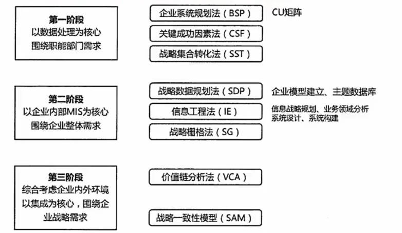

v2 记录

# 目录

## PDF

- 19/222

## Mp4

## 练习题

- 8/108 页码

[开始学习直播](#开始学习直播)

[开始学习录播](#开始学习录播)

- [11计算机硬件-cpu-校验码](#11计算机硬件-cpu-校验码)

- [12指令系统-存储系统-cache](#12指令系统-存储系统-cache)

----

### 开始学习直播

#### 00_1_24年5月直播课_更新中_考前复习看 > 01 .架构专题1.导学-选择题串讲1-24年5月

    ```
    先学习录播
    分层级结构学习，对于不重要内容可跳过
    重点 架构（八大架构）+ 构建 + 网络编程
    ```

### 开始学习录播

#### 01.新大纲_基础精讲新课_第二版

##### 1.1计算机硬件-CPU-校验码

- 计算机 运算器、控制器、存储器、输入设备和输出设备五大部件
- CPU（运算器 + 控制器）、存储器（内部存储 + 外部存储）、外设（输入设备 + 输出设备）
- CPU （运算器、控制器、寄存器组、内部总线 等部件）
- 运算器
  - 算术逻辑单元（ALU）实现对数据的算术和逻辑运算
  - 累加寄存器（AC）运算结果或源操作数的存放区
  - 数据缓冲寄存器（DR）暂时存放内存的指令或数据
  - 状态条件寄存器（SPW）保存指令运行结果的条件码内容
- 控制器
  - 指令寄存器（IR）暂存CPU执行指令
  - 程序计数器（PC）存放指令执行地址
  - 地址寄存器（AR）保存当前CPU所访问的内存地址
  - 指令译码器（ID）分析指令操作码
- CPU 依据 指令周期的不同阶段 来区分二进制的指令和数据
- 码距：在两个编码中，从一个编码到另一个编码所需要改变的位数 称为 码距。
- 奇偶校验码
  - 增加一位校验码来使编码中1的个数为奇数或者偶数。
  - 奇偶校验码 只能校验一位，不能纠错。
- CRC 校验码
  - 只能校验，不能纠错。
  - 需要先约定一个多项式(G(x)=x^5+x^2+x+1)，根据最高阶数 进行原始信息补零，根据多项式求得除数，除数 使用 模二 除法运算（不进位，不借位），求得余数。
  - 余数不足最高阶数，则余数左边用 若干零 补齐。

##### 1.2指令系统-存储系统-cache

- 指令系统
  - 指令的组成： 操作码 + 操作数
  - 操作码： 指明要完成的操作
  - 操作数： 指明参加运算的数据及其所在的单元地址
- 计算机指令执行过程
  - 取指令： 取出程序计数器PC中的指令地址
  - 分析指令：指令译码器进行分析，分析指令操作码
  - 执行指令： 执行指令，取出指令执行所需的源操作数  
- 指令寻址方式：
  - 顺序寻址方式： 一条接着一条指令 顺序执行
  - 跳跃寻址方式： 不是由程序计数器给出，而是由本条指令给出
- 指令操作数的寻址方式
  - 立即寻址方式： 指令的地址码字段指出的不是地址，而是操作数本身
  - 直接寻址方式： 在指令的地址字段中直接指出操作数在主存中的地址
  - 间接寻址方式： 指令地址码字段指向的存储单元中存储的是操作数的地址
  - 寄存器寻址方式： 指令中的地址码是寄存器的编号
- CISC 是复杂指令系统，兼容性强，指令繁多，长度可变，由微程序实现
- RISC 是精简指令系统，指令少，使用频率接近，主要依靠硬件实现（通用寄存器、硬布线逻辑控制）
- 指令流水线原理： 将指令分成不同段，每段由不同的部分去处理
- RISC 的流水线技术：
  - 超流水线技术： 细水长流，以时间换空间。
  - 超标量技术： 内装多条流水线，以空间换时间。
  - 超长指令字技术： 充分发挥软件的作用
- 流水线时间计算
  - 流水线周期： 指令分成不同执行段，其中执行时间最长的段为流水线周期
  - 流水线执行时间： 1条指令总执行时间+（总指令条数-1）*流水线周期
  - 流水线吞吐率计算： 指令条数/流水线执行时间
  - 流水线加速比计算： 不使用流水线执行时间/使用流水线执行时间
- 计算机采用分级存储体系的主要目的是为了解决存储容量、成本和速度之间的矛盾问题。
- 两级存储： Cache-主存、主存-辅存（虚拟存储体系）。
- 局部性原理：
  - 时间局部性：相邻的时间里会再次访问同一个数据项。
  - 空间局部性： 相邻的空间地址会被连续访问。
- 高速缓存Cache用来存储当前最活跃的程序和数据，直接与CPU交互。
- Cache 由控制部分和存储器组成。
- 地址映射：在CPU工作时，送出的是主存单元的地址，而应从Cache存储器中读/取信息。
  - 直接映射：Cache的每一个存储单元对应主存中的一个存储单元
  - 全相连映射： Cache的每一个存储单元对应主存中的多个存储单元
  - 组组相连映射： Cache的每一个组对应多个存储单元，组对应主存中的组概念
- 替换算法：当Cache已满，需要进行替换时，采用不同替换算法，使Cache 获得尽可能高的命中率。
  - 随机替换算法： 随机选择一个Cache块进行替换。
  - 先进先出算法： 按照顺序进行替换。
  - 近期最少使用算法： 选择近期最少使用的Cache块进行替换。
  - 优化替换算法： 需要先执行一次，更具统计情况 进行替换。
- 命中率及平均时间
  - 概念： 当CPU访问问的数据在Cache中时，成为Cache命中，直接从Cache中取出数据。
  - 平均访问时间 = 命中Cache概率 + 主存访问时间*（1-命中Cache概率）

##### 1.3磁盘-输入输出技术-总线

- 磁盘有正反两个盘面，每个盘面有多个同心圆，每个同心圆是一个磁道，每个同心圆又被划分为多个扇区，数据就被存放在一个个扇区中。
- 磁头 首先要寻找到对应的磁道，然后等待磁盘进行周期旋转，旋转到制定的扇区，才能读到对应的数据。
- 存取时间 = 寻道时间 + 等待时间
- 寻道时间：指磁头移动到磁道所需时间。
- 等待时间：指磁头转到等待读写的扇区下方所用的时间。
- 磁盘调度算法（寻道时间耗时最长）
  - 先来先服务：根据进程请求访问磁盘的先后顺序进行调度。
  - 最短寻道时间优先：请求访问的磁道与当前磁道最近的进程优先调度。
  - 扫描算法SCAN： 又称 电梯算法。
  - 单向扫描调度算法CSCAN：只做单向移动，只能从里向外活着从外向里。
- 计算机系统存在多种内存与接口地址的编制方法。
  - 内存与接口地址独立编址方式。
    - 内存地址和接口地址是完全独立的两个地址空间。
    - 缺点是用于接口的指令太少，功能太弱。
  - 内存与接口地址统一编址方法。
    - 内存地址和接口地址统一在一个公共的地址空间里，即内存单元和接口共用地址空间。
    - 优点是原则上用于内存的指令全都可以用于接口。
    - 缺点就在于整个地址空间被分成两部分。
- 计算机和外设间的数据交互方式
  - 程序控制（查询）方式：CPU主动查询外设是否完成数据传输，效率极低。
  - 程序中断方式： 外设完成数据库传输，向CPU发送中断，等待CPU处理数据，效率相对较高。
  - DMA方式（直接从主存存取）：CPU 只需要完成必要的初始化等操作，数据传输的整个过程都由DMA控制器来完成，在主存和外设之间建立直接的数据通路，效率很高。
  - 在一个总线周期结束后，CPU会响应DMA请求开始读取数据；CPU 响应程序中端方式请求是在一条指令执行结束时。
  - 总线：指计算机设备和设备之间传输信息的公共数据通道。
  - 广义上区分：内部总线，系统总线，外部总线。
  - 狭义上区分（系统总线 板级总线）：
    - 数据总线（并行数据传输位数）
    - 地址总线（系统可管理的内存空间的大小）
    - 控制总线（传送控制命令）

##### 2.1操作系统概述-进程管理-同步互斥

- 操作系统的三个作用
  - 管理计算机中运行的程序和分配各种软硬件资源
  - 为用户提供友善的人机界面
  - 为应用程序开发和运行提供一个高效率的平台
- 操作系统的4个特性 并发型、共享性、虚拟性和不确定性。
- 操作系统的功能
  - 进程管理
  - 文件管理
  - 存储管理
  - 设备管理
  - 作业管理
- 操作系统的分类
  - 批处理操作系统
  - 分时操作系统
  - 实时操作系统
  - 网络操作系统
    - 三种模式，集中模式、客户端\服务器模式、对等模式。
  - 分布式操作系统
  - 微型计算机操作系统
- 嵌入式操作系统主要特点
  - 微型化
  - 可定制
  - 实时性
  - 可靠性
  - 易移植性
- 嵌入式系统 初始化过程按照 自底向上、从硬件到软件的次序依次为：片级初始化> 板级初始化> 系统初始化.
- 进程的组成
  - 进程控制块（PCB）： 唯一标志
  - 程序： 描述进程要做什么
  - 数据： 存放进程执行时所需数据
- 进程基础状态三态图
    
- 前趋图： 任务间的并行，任务间的先后顺序。
    ！[img](./2.jpg)
- 进程资源图：用来表示进程和资源之间的分配和请求关系。
    
  - p 代表进程，R 代表资源
  - 阻塞节点： 所请求得资源已经全部分配完毕
  - 非阻塞节点： 所请求得资源还有剩余
  - 当一个进程资源图中 所有进程都是阻塞节点时，即陷入死锁。
- 临界资源: 各进程需要以互斥方式对其访问的资源。
- 临界区：指进程中对临界资源实施操作的那段程序。
- 互斥： 同一时间内只能由一个任务单独使用。
- 同步： 多个任务可以并发执行，只不过有速度上的差异。
- 互斥信号量： 对临界资源采用互斥访问，使用互斥信号量后其他进程无法访问，初始值为1.
- 同步信号量： 对共享资源的访问控制，初值一般是共享资源的数量。
- P操作： 申请资源，S= S-1
- V操作： 释放资源，S= S+1

##### 2.2进程调度-死锁-存储管理-固定分页分段

- 进程调度方式是指 当有更高优先级的进程到来时如何分配CPU。分为可剥夺和不可剥夺两种。
- 在某些操作系统中，一个作业从提交到完成需要经历高、中、低 三级调度。
  - 高级调度。处于输入池中那个后备作业可以调入主系统做好运行的准备。
  - 中级调度。处于交换区中那个就绪进程可以调入内存。
  - 低级调度。处于内存中的那个就绪进程可以占用CPU。
- 调度算法：
  - 先来先服务FCFS
  - 时间片轮转
  - 优先级调度
  - 多级反馈调度： 先按照优先级分为队列，每个队列分配不同时间片长度，进程没有完成降低优先级。
- 死锁
  - 死锁产生的四个必要条件：
    - 资源互斥
    - 每个进程占有资源并等待其他资源
    - 系统不能剥夺进程资源
    - 进程资源图是一个环路
  - 解决措施是打破四大条件
    - 死锁预防
    - 死锁避免
    - 死锁检测
    - 死锁解除
  - 死锁资源计算
    - 发生死锁最大资源数 = n*(R-1)
    - 不发生死锁最小资源数 = n*(R-1) + 1
- 进程：可拥有资源的独立单位；可独立调度和分配的基本单位。
  - 进程数目不已过多，切换频率不宜太高。
- 线程：调度和分配的基本单位，进程 独立分配资源的单位。
- 线程基本上不拥有资源，只拥有一点运行中必不可少的资源（程序计数器，一组寄存器和栈），可以与同属一个进程的其他线程共享进程所拥有的全部资源。
- 分区存储组织，就是整存，将某进程运行所需的内存整体一起分配给它。
  - 三种分区方式
    - 固定分区： 静态分区方法，会产生内部碎片。
    - 可变分区： 动态分区方法，会产生外部碎片。
  - 可重定位分区：可以解决碎片问题，移动分区。
    - 首次适应法
    - 最佳适应法
    - 最差适应法
    - 循环首次适应法
    
- 逻辑页 分为页号和业内地址
  - 优点： 利用率高，碎片小，分配及管理简单
  - 缺点： 增加了系统开销，可能产生抖动现象。
  - 页面置换算法
    - 最优算法：理论上的方法，没有实际意义。
    - 先进先出算法
    - 最近最少使用算法
  - 淘汰原则： 优先淘汰最近未访问的，而后淘汰最近未被修改的页。
  - 快表 是一块小容量的相连存储器，
    - 按内容访问，速度快，
    - 存放当前访问最频繁的少数活动页面的页号。
  - 快表是将页表存于Cache中；慢表是将页表存于内存上。
- 段
  - 每段也有段号和段内地址
  - 每段物理地址不同，分段式根据逻辑整体分段的，
  - 段表有段长和基址两个属性。
- 段页式
  - 对进程空间 先分段，后分页。

##### 2.3设备管理-文件管理

- 设备  
  - 是计算机系统与外界交互的工具，具体负责计算机与外部的输入/输出工作，所以常称为外部设备（简称外设）。
  - 设备分类
    - 按数据组织分类
    - 按设备功能分类
    - 资源分配角度分类
    - 数据传输速率分类
  - 设备管理任务 多个进程竞争使用设备时，按照一定策略分配和管理各种设备。
  - 设备主要功能 动态地掌握并记录设备的状态
  - 设备的层次结构
      
  - 设备管理技术 引入SPOOLING（外围设备联机技术）， 每个进程都感觉在使用一个打印机，这就是物理设备的虚拟化。  
- 文件
  - 文件是具有符号名的，在逻辑上具有完整意义的一组相关信息项的集合。
  - 信息项是构成文件内容的基本单位，一个文件包括文件体和文件说明。
  - 文件管理系统， 就是操作系统中 实现 文件 统一管理的一组软件和相关数据的集合，专门负责管理和存取文件信息的软件机构。
  - 文件的逻辑结构： 有结构的记录式文件 和 无结构的流式文件。
  - 文件的物理结构 是指 文件在物理存储设备上的存放方法。
    - 连续结构。将逻辑上连续的文件信息依次存放在连续编号的物理块上。
    - 链接结构。将逻辑上连续的文件信息存放在不连续的物理块上，每个物理块设有一个指针指向下一个物理块。
    - 索引结构。将逻辑上连续的文件信息存放在不连续的物理课上，索引表记录了文件信息所在的逻辑块号对应的物理块号。
    - 索引表式在文件创建时由紫铜自动建立的。
      - 直接索引，每个索引节点存放的是内容。
      - 一级间接索引， 存放链接到直接物理盘块的地址。
      - 二级间接索引，直接存放一级地址，一级地址再存放直接物理盘块地址，而后链接存放数据的物理盘块。
  - 文件控制块的有序集合称为文件目录
  - 相对路径： 是从当前路径开始的路径。
  - 绝对路径： 是从根路径开始的路径。
  - 全文件名 = 绝对路径+文件名。
  - 文件的存取方式是指读/写文件存储器上的一个物理块的方法。通常有顺序存取和随机存取。
  - 位示图。每一位对应文件存储器上的一个物理块，取值0和1 分别表示空闲和占用。

##### 3.1概述-三级模式-数据库设计-数据模型

- 三级模式： 外模式-模式（概念模式）-内模式
- 两级映像： 外模式-模式 和 模式-内模式
- 数据库设计
  - 需求分析 产出 数据流图，数据字典，需求说明书
  - 概念结构设计 产出 ER模型
  - 逻辑结构设计 产出 关系模型
  - 物理设计 产出 数据库表
  - 数据库实施阶段  
  - 数据库运行和维护阶段
- 关系模型 是 二维表的形式表示的实体-联系模型。
- 概念模型是从用户的角度进行建模的。
- 数据模型三要素：数据结构，数据操作，数据的完成性约束。
- 在E-R模型中，使用椭圆表示属性（一般没有），长方形表示实体，菱形表示联系，联系的两端要填写联系类型。
- 实体与弱实体，弱实体依赖实体。
- 实体: 客观存在并可相互区别的事物。
- 属性：实体所具有的特性。
- 联系： 事物内部以及事物之间的联系， 反映实体内部的联系和实体之间的关系。
- 联系类型： 一对一 1:1, 一对多 1:n， 多对多 m:n

-

##### 3.2关系代数-函数依赖-范式

- 关系代数
  - 并 u ：两张表中所有记录数合并，相同记录只显示一次
  - 交 n : 两张表中相同的记录
  - 差 - : s表中存在，t表中不存在的记录
  - 笛卡尔积 * : 两个集合的乘积，即两个组合所有可能的记录
  - 投影： 按照指定的属性列，从表中提取记录
  - 选择： 按照指定的行，从表中提取记录
  - 自然连接 ⨝：将两个表中相同属性相同值的数据组合新的表
- 函数依赖
  - 部分函数依赖： （A,B）中的一部分可以确定C
  - 传递函数依赖： A 可以确定 B， B 可以确定 C。
- 键与约束
  - 超键： 能唯一标识此表的属性的组合。
  - 候选键： 超键中去掉冗余的属性，剩余的属性就是候选键。
  - 主键： 任选一个候选键，即可为主键。
  - 外键：其他表中的主键。
  - 主属性：候选键内的属性为主属性，其他属性为非主属性。

  - 主键约束： 主键值不能为空，也不能重复。
  - 外键必须是其他表中已经存在的主键的值，或者为空。
- 范式
  - 第一范式： 每一个分量必须是一个不可分的数据项。
  - 第二范式： 建立在第一范式的基础上，每一个非主属性 不会依赖 复合主键中的某一个列。
  - 第三范式： 建立在第二范式的基础上，不存在非主属性对码的传递依赖。
  - BC范式： 在每一种情况下，每一个依赖的左边 决定因素都必然包含候选键。

##### 3.3模式分解-事务并发-封锁协议

- 模式分解
- 无损分解：当分解为两个关系模式，如果R的分解为p＝{R1, R2}, 无损分解, 充分必要条件是 R1 n R2->(R1-R2) 或者 R1 n R2-> (R2-R1).
- 并发控制
  - 事务
    - ACID 原子性、一致性、隔离性、持久性
    - 丢失更新、不可重复读、读脏数据
- 封锁协议
  - x锁是排它锁（写锁），其他事务都不能对A加任何类型的锁。
  - s锁是共享锁（读锁），其他事务可以加S锁，但布恩那个加x锁。

  - 一级封锁协议： 事务在修改数据R之前必须先对其加x锁，直到事务结束才释放，可解决丢失更新问题。
  - 二级封锁协议： 一级封锁协议基础上，加上事务T在 读数据R之前必须先对其加S锁，读完可释放S锁，解决丢失更新及读脏数据问题。
  - 三级封锁协议： 二级封锁协议基础上，要求事务在读取数据之前必须先对其加读锁，修改数据之前必须先对其加上写锁。三级可以结束丢失更新，读脏数据及不可重复读问题。

##### 3.4数据库新技术-SQL语言

- 数据库安全
  - 静态转储， 冷备份
  - 动态转储， 热备份
    - 完全备份：备份所有数据
    - 差量备份： 仅备份上一次完全备份后变化的数据。
    - 增量本分： 备份上一次备份之后变化的数据。
- 分片模式
  - 水平分片： 将表中水平的记录分别存放在不同的地方。
  - 垂直分片： 将表中垂直的列值分别存放在不同的地方。
- 分布透明性
  - 分片透明性： 用户或应用程序 不需要知道逻辑上访问的表具体是如何分块存储的。
  - 位置透明性： 应用程序不关心数据存储物理位置的改变。
  - 逻辑透明性： 用户或应用程序无需知道局部使用的是哪种数据模型。
  - 复制透明性： 用户或应用程序不关心复制的数据从何而来。

- 数据仓库 是一个 面向主题的，继承的，非易失的，且随时间变化的数据集合，用于支持管理决策。
- 数据仓库的结构通常包含四个层次。
  - 1. 数据库源
  - 2. 数据的存储与管理
  - 3. OLAP（联机分析处理）服务器。
  - 4. 前端工具  
- SQL　语言
  - 数据库查询 select ... from ... where;
  - 分组查询 group by
  - 更名运算 as
  - 字符串匹配 like, % 多个，_ 匹配任意一个
  - 数据库插入 insert into ... values()
  - 数据库删除 delete from ... where
  - 数据库修改 update ... set ... where
  - 排序 order by， 默认升序，降序 DESC  

##### 4.1嵌入式微处理器-多核处理器.嵌入式技术

- 冯.诺伊曼 结构，也称 普林斯顿结构，是一种将程序指令存储器和数据存储器合并在一起的存储器结构。

- 哈佛结构 是一种并行体系结构，将程序和数据存储在不同的存储空间中， 两个相互独立的存储器，每个存储器独立编址，独立访问。

- 两套独立的地址总线和数据总线。
- 一个机器周期内同时获取指令字（来自程序计数器）和操作数（来自数据存储器）。

- 根据嵌入式微处理器的字长宽度，可分为4位，8位，16...
- 按照用途分类，一般分为嵌入式 微控制器MCU，嵌入式微处理器MPU，嵌入式数字信号处理器DSP，嵌入式片上系统SOC等
  - 嵌入式 微控制器 MCU，典型代表　单片机，　是嵌入式系统工业的主流。
  - 嵌入式 微处理器 MPU，以最低的功耗和资源实现嵌入式应用的特殊要求。常见的arm， MIPS， POWER PC 等
  - 嵌入式数字信号处理器DSP，专门用于信号处理方面的处理器，　具有很高的编译效率和指令的执行速度。
  - 嵌入式片上系统SOC， 追求产品系统最大包容的集成器件。

- 多核指多个微处理器内核，是将两个或更多的微处理器封装在一起，集成在一个电路中。
  多核处理器是单枚芯片。多核与多CPU相比，很好的降低了计算机系统的功耗和体积。由操作系统软件进行调度，多进程，多线程并发都可以。

##### 4.2嵌入式软件-系统-RTOS-软件开发

- 嵌入式软件
  - 指 应用在嵌入式计算机系统当中的各种软件， 包括 规模较小，开发难度大，实时性和可靠性高，要求固化存储。
  - 分类
    - 系统软件，控制和管理嵌入式系统资源
    - 应用软件
    - 支撑软件，辅助软件开发的工具软件  
- 板级支持包（BSP） 介于主板硬件和操作系统中驱动层程序之间的一层。
- 特点
  - 硬件相关性
  - 操作系统相关性
  - BSP 主要包括两个方面的内容：引导加载程序 BootLoader 和 设备驱动程序。
  - BootLoader 是嵌入式系统加电后运行的第一段软件代码， 可以初始化硬件设备，建立内存空间的映射图，从而将系统的软硬件环境设置到一个合适的状态，以便最终调用操作系统内核做好准备。
  
  - 片级初始化： 主要完成微处理器的初始化，包括设置微处理器的核心寄存器，和控制寄存器，微处理器的核心工作模式及其局部总线等。
  - 板级初始化： 正确地设置各种寄存器的内容来完成微处理器以外的其他硬件设备的初始化。
  - 加载内核（系统初始化）： 将操作系统和应用程序的映像从Flash存储器复制到系统的内存当中。
  - 在一个嵌入式系统当中，操作系统是可能可有可无的，但无论如何，设备驱动程序是必不可少的。所谓的设备驱动程序，就是一组函数，用来对硬件进行初始化和管理，并向上层软件提供良好的访问接口。
  - 大多数设备驱动程序具备以下基本功能
    - 硬件启动，在开机上电或系统重启的时候，对硬件进行初始化。
    - 硬件关闭，将硬件设置为关机状态。
    - 硬件停用，暂停使用这个硬件。
    - 硬件启用，重新启用这个硬件。
    - 读操作：从硬件中读取数据。
    - 写操作：往硬件中写入数据。
  - 一般嵌入式系统 由 嵌入式处理器，相关支撑硬件，嵌入式操作系统，支撑软件及应用软件组成。
  - 嵌入式系统应具备以下特性
    - 专用性强
    - 技术融合
    - 软硬一体软件为主
    - 比通用计算机资源少
    - 程序代码固化在非易失存储器中
    - 需专门开发工具和环境
    - 体积小，价格低，工艺先进，性能价格比高，系统配置要求低，实时性强。
    - 对安全性和可靠性要求高
- 根据不同用途可以将嵌入式系统划分为嵌入式实时系统和嵌入式非实时系统。而实时性系统可以分为强实时性系统和弱实时系统。
- 嵌入式系统可分为 硬件层，抽象层，操作系统层，中间件层和应用层。
- 嵌入式数据库系统EDMBS
  - 使用环境的特点：
    - 设备随时移动性
    - 网络频繁断接
    - 网络条件多样化
    - 通信能力不对称
  - 一个完成的EDBMS由若干个子系统组成，包括主数据库，同步服务器，嵌入式数据库和连接网络。
  - 嵌入式数据库在实际应用中必须解决好数据的一致性，高效的事务处理和数据的安全性。
  - 嵌入式操作系统EOS 微型化，代码质量高，专业化，实时性强，可裁剪和可配置。
  - 要求 系统在投入运行前即具有确定性和可预测性。
  - 可预测性是指系统在运行之前，其功能，响应特性和执行结果是可预测的。
  - 确定性是指系统在给定的状态和输入条件下，在确定的时间内给出确定的结果。
  - 实时操作系统的特征
    - 高精度计时特征
    - 多级中断机制
    - 实时调度机制
- 各一个典型的交叉平台环境，包含三个高度集成的部分：
  - 强有力的交叉开发工具和实时程序
  - 高性能，可裁剪的实时操作系统
  - 连接宿主机和目标机的多种通信方式
- 交叉编译 嵌入式软件开发所采用的编译为交叉编译。所谓交叉编译就是在一个平台生成可以在另一个平台上执行的代码。
- 嵌入式系统的开发需要借助宿主机（通用计算机）来编译出目标机的可执行代码。
- 交叉调试 在宿主机和目标机之间进行的交叉调试，调试器仍然在宿主机的通用系统上，但被调试的进程却是运行在基于特定硬件平台的嵌入式操作系统中。

##### 5.1七层模型-局域网-TCPIP协议族

- 计算机网络的功能 数据通信，资源共享，管理集中化，实现分布式处理，负载均衡
- 网络性能指标 速率，带宽，吞吐量，时延， 往返时间，利用率
- 分布范围&拓扑结构 划分
- 局域网 Lan 1000m
- 城域网 Man 10km
- 广域网 Wan 100km
- 计算机网络是利用通信技术将数据从一个结点传送到另一个结点的过程。
- 同时传递多路数据就需要复用技术和多址技术。
- osi 七层
  
  - 物理层 在链路上透明地传输位， 比特， 中继器，集线器
  - 数据链路层 把不可靠的信道编程可靠的信道，帧，交换器，网桥
  - 网络层 在源节点-目的节点 之间进行路由选择，拥塞控制，顺序控制，传送包，保证报文的正确性。IP分组，网关
  - 传输层 提供断-端间可靠的，透明的数据传输， 报文段，网关
  - 应用层 对用户不透明的提供各种服务，数据，Telnet,ftp,http, smtp, pop3,dns, dhcp 等，网关
- 协议端口号 对照表
  

##### 5.2传输介质-通信方式-IP地址-子网划分

- 双绞线 分为 无屏蔽双绞线UTP 和 屏蔽双绞线STP
  - 无屏蔽 价格低，安装简单，抗干扰差
  - 屏蔽 提高可靠性，价格高，安装麻烦
- 网线 T568A, T568B 1236 颜色不同，绿色先
- 多模光纤 MMF 同时传输多种不同的信号，采用发光二极管LED为光源，成本低，但是传输的效率和可靠性都较低，适合短距离传输。
- 单模光纤 一般只能传输一种信号，采用激光二极管LD作为光源，并且只支持激光信号的传播，成本高，传输距离远，可靠性高。
- 交换方式
  - 电路交换
  - 报文交换
  - 分组交换
  - 数据包 各个分组携带地址信息，自由的选择不同的路由路径
  - 虚电路 二者之间建立了一个虚拟的通信线路
  - 信元交换 异步传输模式ATM采用的交换方式，信元是固定长度的分组
- IP地址
  - IP地址是32位的二进制代码，每隔8位插入一个空格，采用点分十进制方法来表示，每8位二进制转换成十进制，就变成了4个十进制数。
  - 每个十进制数的取值范围为0-255.
  - 分类IP 地址
    - A类 0.0.0.0 - 127.255.255.255
    - B类 128.0.0.0 - 191.255.255.255
    - C类 192.0.0.0 - 223.255.255.255
  - 特殊IP地址
    - 公有 通过它可以直接访问因特网，是全网唯一的IP地址
    - 私有非注册地址，专门为组织机构内部使用
  - 子网划分
    - 主机数之间相差的太大了，不利于分配，我们一般采用子网划分的方法来划分网络，即自定义网络号位数，根据主机个数来划分出最适合的方案，不会造成资源的浪费。
    - 将主机号拿出几位作为子网号，此时IP地址组成为 网络号+子网号+主机号
    - 网络号和子网号都为1， 主机号都为0，这样的地址为子网掩码。
    - 主机号不能全0或全1，因此，主机数需要-2，而子网数不用。

##### 5.3IPv6-网络规划-网络存储-补充考点

- 三层模型
  - 将网络分为核心层，汇聚层，接入层
  - 核心层 提供不同区域之间的最佳路由和高速数据传送
  - 汇聚层 将网络业务连接到接入层，并且实施与安全、流量、负载、路由相关的策略
  - 接入层 为用户提供了在本地网段访问应用系统的能力

- 建筑物综合布线系统PDS
  - 工作区子系统　实现　设备与信息插座之间的互联
  - 水平布线子系统 实现 信息插座和管理子系统之间的连接
  - 垂直布线 实现各楼层设备之间
  - 设备间  实现中央主配线架与各种不同设备
  - 管理子系统 连接各楼层水平和垂直干缆线
  - 建筑群子系统 各个建筑物通信系统
- NAT 网络地址翻译
  > 将公司所有电脑这个大的地址集合映射到能够访问因特网的少量IP地址的过程就称为NAT。
－　虚拟局域网VLAN  
  > 一个VLAN就是一个广播域。
- 虚拟专用网VPN，是在公用网络上建立专用网络的技术。
- 冲突域和广播域
  - 路由器可以阻断广播域和冲突域，交换机只能阻断冲突域，因此一个路由器下可以划分多个广播域和多个冲突域；一个交换机下整体式一个广播域，但可以划分多个冲突域。而
  物理层设备集线器下整体作为一个冲突域和一个广播域。

##### 6.其他计算机系统基础知识

- 计算机语言主要由一套指令组成，而这种指令一般包括表达式，流程控制和集合三大部分内容。
- 表达式 包含变量，常量，字面量和运算符。
- 流程控制 有 分支，循环，函数和异常。
- 集合包括 字符串，数组，散列表。

- 计算机语言的分类

  1. 机器语言 最早使用，第一代计算机语言，计算机自身语言，二进制码串。
  机器语言指令必须包括： 操作码，操作数的地址，操作结果的存储地址，下条指令的地址。
  2. 汇编语言 用一些简洁的英文字母，符号串来替代一个特定指令的二进制串。第二代。
    汇编语言3种语句：指令（汇编后直接产生机器代码）、伪指令（指示汇编源程序时完成的操作，汇编后不产生机器代码）、
    宏指令（多次重复使用的程序段，宏的引用）

  - 指令语句和伪指令语句格式： 名字（标号，第一个字节单元地址）， 操作符，操作数，注释。

  3. 高级语言 一类语言统称，符合人类习惯，如C，C++
  4. 建模语言 主导地位是面向对象的建模技术，主要使用UML作为建模语言
  5. 形式化语言 形式化方法是把概念，判断，推理 转化成特定的形式后，对形式符号表达系统进行研究的方法。
    形式化开发过程： 可行性分析，需求分析，体系结构分析，详细设计，编码，测试发布。

- 媒体 信息的表现形式，媒体可分为感觉媒体，表示媒体，显示媒体，存储媒体和传输媒体。
  - 感觉媒体 指 用户接触的信息的感觉形式，如视觉，听觉和触觉等
  - 表示媒体 指 信息的表示形式，如 图像，声音，视频等
  - 存储媒体 指 用于存储表示媒体的物理介质， 如硬盘，软盘，磁盘，光盘，POM　及　RAM等
  - 传输媒体 指 传输表示媒体的物理介质 如 电缆，光缆和电磁波

  - 多媒体有4个主要特征
    - 多维化 指媒体的多样性
    - 集成性
    - 交互性
    - 实时性

  - 多媒体系统的关键技术

  1. 音视频技术
  2. 通信技术
  3. 数据压缩技术

  - 即时压缩和非即时 区别在于信息在传输过程中被压缩还是信息压缩后再传输。
  - 数据压缩和文件压缩 指具有时间性的数据，即时采集。文件压缩 是指 将要保存在磁盘等物理机制的数据进行压缩。
  - 无损压缩与有损压缩，无损压缩的压缩比比较低。
  - 压缩编码格式：JPEG，MPEG，  H.26l

- 虚拟现实（VR）和增强现实（AR）技术
  VR 是一种可以创建和体验 虚拟世界的计算机仿真系统，它利用计算机生成一种模拟环境，使用户沉浸到该环境中，给人身临其境的感觉。

  - 虚拟实体是用计算机生成的一个逼真的实体。
  - 用户可以通过人的自然技能（头部转动，眼动，手势）与该环境交互
  - 要借助一些三维传感设备来完成交互动作

  - 增强现实技术 在现实世界的一定时间和空间范围内很难体验到的实体信息（视觉信息，声音，味道和触觉等），通过模拟仿真后，再叠加到现实世界中被人类感官所感知，从而达到超越现实的感官体验
    - 计算机图形图像技术。增强现实的用户可以戴上透明的护目镜，透过它看到整个世界，连同计算机生成而投射到这一世界表面的图像。
    - 空间定位技术，当用户转动或移动头部时，视野变动，计算机产生的增强信息随之做相应的变化。
    - 人文智能 发挥传感器，可穿戴计算等技术的优势，使人们能够捕获自己的日常经历，记忆及所见所闻。
    - VR、AR　技术主要分为桌面式，分布式，沉浸式和增强式。
  - 系统工程时利用计算机作为工具，对系统的结构，元素，信息和反馈等进行分析，以达到最优规划，最优设计，最优管理和最优控制的目的。
  - 系统之系统（SoS）适用于其系统元素本身也是系统的情况。
  - 系统工程方法时一种现代的科学决策方法，进行全面的分析和处理。

- 霍尔的三维结构。i

  - 分为前后衔接的7个阶段和7个步骤 形成了由时间维，逻辑维和知识维组成的三维空间结构。
  - 时间维表示系统工程活动从开始到结束按时间顺序排列的全过程，分为规划，拟定方案，研制，生产，安装，运行，更新 7个 时间阶段
  - 逻辑维是指时间维每个阶段内所要进行的工作内容和应该遵循的思维的程序，包括明确问题，确定目标，系统综合，系统分析，优化，决策，实施 7个逻辑步骤。
  - 知识维 各种知识和技能。

- 切克兰德方法。社会经济系统中的问题，核心不是最优化，而是比较和探寻。从模型和现状的比较中来学习改善现状的途径。
  1. 认识问题
  2. 根底定义
  3. 建立概念模型
  4. 比较及探寻
  5. 选择
  6. 设计与实施
  7. 评估与反馈

- 并行工程方法。是对产品及其相关过程（包括制造过程和支持过程）进行并行，集成化处理的系统方法和综合技术。要求产品开发人员从设计开始就考虑产品生命周期的全过程。

  - 并行工程的目标是提高质量，降低成本，缩短产品开发周期和产品上市时间。
  - 并行工程强调以下3点
    - 1. 在产品的设计开发期间
    - 2. 各项工作由与此相关的项目小组完成
    - 3. 依据适当的信息系统工具，反馈与协调整个项目的进行

- 综合集成法。首次把处理开发的复杂巨系统（子系统数量巨大、种类多关联、开放）的方法命名为从定性到定量的综合集成法。综合集成是从整体上考虑并解决问题的方法论。是现代科学条件下人事方法论上的一次飞跃。

  - 一是 整体论原则； 二是 相互联系的原则； 三是 有序性原则； 四是 动态原则。
  - 开放的复杂巨系统主要性质：开放性，复杂性，进化与涌现性，层次性，巨量性
  - 综合集成方法的主要特点有：
    - 1. 定性研究与定量研究
    - 2. 科学理论与经验知识

- WSR（物理-事理-人理） 懂物理，明事理，通情理。

  - WSR 一般工作流程可理解为 7步： 理解意图，指定目标，调查分析，构造策略，选择方案，协调关系和实现构想。

- 系统工程 生命周期7阶段
  - 1. 探索性研究阶段
  - 2. 概念阶段
  - 3. 开发阶段
  - 4. 生产阶段
  - 5. 使用阶段
  - 6. 保障阶段
  - 7. 退役阶段

  - 生命周期方法
  - 计划驱动方法， 始终遵守规定流程的系统化方法。
  - 渐进迭代式开发， 允许为项目提供一个初始能力，随之提供连续交付以达到期望的系统。
  - 精益开发， 向客户交付最大价值并使浪费活动最小化。
  - 敏捷开发

- 基于模型的系统工程（MBSE）
  - 是建模方法的形式化应用，以使建模方法支持系统需求，分析，设计，验证和确认等活动。
  - 系统工程过程的三个阶段分别产生三种图形：
  - 在需求分析阶段，产生需求图，用例图及包图。
  - 在功能分析与分配阶段，产生顺序图，活动图及状态机图。
  - 在设计综合阶段，产生模块定义图，内部块图及参数图等。
  - MBSE 的三大支柱分别是 建模语言（SysML）, 建模工具和建模思路。

##### 7.系统配置与性能评价

- 计算机
  - 计算机评价的主要性能指标有： 时钟频率（主频）、运算速度、运算精度、内存的存储容量、存储器的存取周期、数据处理速率PDR、
    吞吐率、各种响应时间、RASIS特性（可靠性Reliability、可用性Availability、可维护性Sericeability、完整性和安全性Integraity and Security）、
    平均故障响应时间，兼容性，可扩充性，性能价格比。
- 路由器
  - 设备吞吐量、端口吞吐量、丢包率、时延、时延抖动
- 网络 设备级性能指标，网络级性能指标，应用级性能指标，用户级性能指标，吞吐量
- 操作系统 系统的可靠性，系统的吞吐率，系统响应时间，系统资源利用率，可移植性
- 数据库管理系统 衡量数据库管理系统的主要性能指标 包括数据库本身和管理系统两部分有
  - 数据库的大小，数据库中表的数量，单个表的大小，表中允许的记录（行）数量，单个记录（行）的大小，表上所允许的索引数量，数据库所允许的索引数量，最大并发事务处理能力，负载均衡能力，最大连接数等等
- web 服务器
  - 评价Web服务器的主要性能指标有： 最大并发连接数、响应延迟、吞吐量。  
- 性能评测的常用方法
  1. 时钟频率。一般来讲，主频越高，速度越快。
  2. 指令执行速度。计量单位 KIPS，MIPS。
  3. 等效指令速度法。统计各类指令在程序中所占比例，并进行折算，是一种固定比例法。
  4. 数据处理效率法。采用计算PDR值的方法来衡量机器性能，PDR值越大，机器性能越好。PDR与每条指令和每个操作数的平均位数以及每条指令的平均运算速度有关。
  基准程序法：　把应用程序中用得最多，最频繁的那部分核心程序作为评价计算机性能的标准程序，称为基准测试程序。是目前被用户一致承认的测试性能较好方法。
  - 整数测试程序，浮点测试程序，SPEC基准程序，TPC 基准程序 TPC-C 是在线事务处理（OLTP）基准程序，TPC-D 是决策支持的基准程序。TPC-E 是作为大型企业信息服务的基准程序。

  - 评测的准确度依次递减： 真实的程序、核心程序、小型基准程序、合成基准程序。
- 阿姆达尔定律
  主要用于系统性能改进的计算中。是指计算机系统中对某一部件采用某种更快的执行方式所获得的系统性能能改变程度，取决于这种方式被使用的频率，或所占总执行时间的比例。

- 加速比。 不使用增强部件时完成整个任务的时间/使用增强部件时完成整个任务的时间。
- 总加速比。原来的执行时间/新的执行时间=1/((1-增强比例)+增强比例/增强加速比)

##### 8.1信息系统概述-生命周期

- 信息系统
  - 是以处理信息流为目的的人机一体化系统。
  - 5个基本功能：输入，存储，处理，输出和控制。
  - 性质 是 以计算机为基础，人机交互。
- 诺兰模型
  1. 初始阶段，只作为办公设备使用，应用非常少。
  2. 传播阶段，大幅度增加软件投入，盲目投入生产问题，效率低。
  3. 控制阶段，从整体上 解决数据共享问题。呈现 单点，分散的特点，系统和资源利用率不高。是计算机管理变为数据管理的关键。
  4. 集成阶段，建立基础数据库，并建成统一的信息管理系统。使人，财，物等资源信息能够在企业集成共享。
  5. 数据管理，意识到信息战略的重要，使用统一平台，各部门，各系统基本实现 资源整合和信息共享。
  6. 成熟阶段，满足企业各个层次的需求。
- 信息系统的分类（低级到高级）
  1. 业务（数据）处理系统（TPS、DPS） 企业局部业务（数据）的管理。
  2. 管理信息系统（MIS） 能进行管理信息的收集，传输，存储，加工，维护和使用的系统。形成了对企业全局性的，整体性的计算机应用，更多的侧重于企业内部。
  3. 决策支持系统（DSS） 帮助决策者利用数据和模型去解决半结构化决策问题和非结构化问题的交互式系统。
  4. 专家系统（ES） 利用人类专家的知识和解决问题的方式来处理该领域的问题。
  5. 办公自动化系统（OA） 人机结合的综合性的办公事务管理系统，办公活动。

- ERP（企业资源管理）、WMS系统（仓储管理系统）、MES系统（SFC　制造过程管理系统）和　产品数据管理系统（PDM）
  - ERP系统　管理公司的各种资源。
  - WMS系统  库房货位管理
  - MES系统  生产过程和生产过程中防呆、自动化设备集成。
  - PDM系统　管理研发阶段的物料、BOM、工程变更数据，负责产品数据为主。
- 信息系统的生命周期（产生，开发，运行，消亡）
  - 产生阶段，概念阶段或者是信息系统的需求分析阶段。一是概念的产生过程，初步想法。二是需求分析过程，形成需求分析报告。
  - 开发阶段， 最重要，关键的阶段。包括总体规划，系统分析，系统设计，系统实施和系统验收这五个阶段。
    - 1. 总体规划阶段。基础是需求分析。作用和地位，信息系统的开发目标，信息系统的总体架构，信息系统的组织结构和管理流程，信息系统的实施计划，信息系统的技术规范等。
    - 2. 系统分析阶段。为系统设计阶段提供系统的逻辑模型。它是企业的管理流程和信息流程的交汇点。包括组织结构及功能分析，业务流程分析，数据和数据流程分析，系统初步方案等。
    - 3. 系统设计阶段。 设计出信息系统的实施方案。
    - 4. 实施阶段。在计算机和网络上具体实现，用户的参与特别重要。
    - 5. 系统验收阶段。试运行。
  - 运行阶段 正式移交给用户以后，系统就进入了运行阶段。  
  - 消亡阶段 在信息系统建设的初期企业就应当注意系统的消亡条件和时机。
  - 信息系统建设的原则，高层管理人员介入原则，用户参与开发原则，自顶向下原则，工程化原则，其他原则（创新性，整体性，发展性，经济性等）

##### 8.2开发方法-TPC-MIS-DSS

- 信息系统开发方法
  1. 结构化方法 由结构化分析（SA），结构化设计（SD），结构化程序设计（SP） 自顶向下，逐步求精和模块化设计。
  - 主要特点 1. 开发目标清晰化，2. 开发工作阶段化，3. 开发文档规范化，4. 设计方法结构化。
  - 不足和局限 1. 开发周期长， 2. 难以适应需求变化，3.很少考虑数据结构
  - 常用工具有数据流图，数据字典，结构化语言，判定表及判定树等。
  2. 原型化方法。 快速地建立一个系统模型展示给用户，在此基础上于用户交流。
  - 原型法 可以 使 系统开发的周期缩短，成本和风险降低，速度加快，获得较高的综合开发效益。
  - 是以用户为中心来开发系统的，增加了用户的满意度，提高了系统开发的成功率。
  - 由于用户参与了系统开发的全过程，有利于系统的移交，有利于系统的运行和维护。
  - 不足，开发的环境要求高，管理水平要求高。
  3. 面向对象方法。客观世界是由各种对象组成的。
  - 使用OO方法构造的系统具有更好的复用性。
  - 使用OO方法具有更好的复用性，其关键在于建立一个全面，合理，统一的模型。
  - 三个阶段之间没有 缝隙。
  - 面向对象方法可以普遍适用于各类信息系统的开发。

  - 面向对象方法的不足之处： 必须依靠一定的面向对象技术支持，在大型项目的开发上具有一定的局限性，不能涉足系统分析以前的开发环节。

  - 一些大型信息系统的开发，通常是将结构化方法和OO方法结合起来。
  4. 面向服务方法。 进一步将接口的定义与实现进行解耦，则催生了服务和面向服务的开发方法。
  - 信息系统快速响应需求与环境变化，提高系统可复用性，信息资源共享和系统之间的互操作性
- 业务处理系统TPS
  - 电子数据处理系统（EDP），最初级形式的信息系统，针对管理中具体的事务。
    - 日常事务所发生的数据进行输入，处理和输出。处理周期由5各阶段构成：数据输入，数据处理，数据库的维护，文件报表的生成和查询处理。
    1. 数据输入。大量原始数据准确，迅速地输入到计算机系统中。
    2. 数据处理。 一种批处理方式， 一种联机事务处理方式（OLTP， 实时处理）。
    3. 数据库的维护，一个组织的数据库通过TPS来更新，以确保数据库中的数据能及时，正确地反映当时最新的经营状况。
    4. 文件报表的产生。TPS的输出就是为终端用户提供有关文件和报表。
    5. 查询处理。TPS支持终端用户的批次查询或联机实时查询。
    - 特点 TPS是其他类型信息系统的信息产生器，是处于企业系统的边界，面对的是结构化程度很高的管理问题。
- 管理信息系统MIS
  - 由业务处理系统发展而成的，是在TPS基础上引进大量管理方法对企业整体信息进行处理，并利用信息进行预测，控制，计划，辅助企业全面管理的信息系统。
  - 管理信息系统由四大部件组成，即信息源，信息处理器，信息用户和信息管理者。
  - 分为战略计划，管理控制和运行控制三层。
  - 职能的完成往往是通过 过程 实现，过程是逻辑上相关活动的集合，表示成功能-过程结构。
- 决策支持系统DSS
  - DSS 为解决非结构化管理问题提供支持，以改善决策的质量。
  - 基本模式反映DSS的形式及其与 真实系统，人和外部环境的关系，管理者处于核心地位。
  - DSS 两种基本数据结构形式是 两库结构和基于知识的结构，两库结构由数据库子系统，模型库子系统和对话子系统形成三角形分布的机构。
  - 决策支持系统的总体功能是支持各种层次的人们进行决策。
  - 决策支持系统的组成
  - 1. 数据的重组和确认，获得正确的数据并且可用理想的形式操作这些数据。
  - 2. 数据字典的建立，对数据仓库的获取。
  - 3. 数据挖掘和智能体，运用工具进行数据存取和查询，使用工具称为智能体。
  - 4. 模型建立， 帮助决策者理解与选择有关的现象。

##### 8.3ES-OAS-ERP-电子政务-企业信息化

- 专家系统ES
  - 基于知识的专家系统简称为专家系统，是人工智能的一个重要分支。
  - 专家系统不同于传统的应用程序和其他类型的人工智能问题求解程序。
    - 1. 求解的问题是半结构化和非结构化问题。
    - 2. 人类专家在问题领域的推理。
    - 3. 三要素，描述问题状态的综合数据库，存放启发式经验知识的知识库和对知识库的知识进行推理的推理机。三要素分别对应数据级，知识级和控制级。
    - 4. 处理的问题是实际的问题。
    - 5. 专用性强，通用性差。
  - 人工智能（AI）模仿人类的智能。
  - AI 具有智能行为的计算机系统上。
  - 1. 从过去的时间或情形中汲取经验
  - 2. 在缺乏重要信息时解决问题的能力
  - 3. 处理和操纵各种符号，理解形象化图片（图像）的能力。
  - 4. 想象力和创造力。
  - 5. 善于启发。
  - AI 主要分支有专家系统，机器人系统，视觉系统，自然语言处理，学习系统和神经网络等。
  - 知识库 用来存放系统求解实际问题的领域知识。一类为事实性知识，一类为启发性知识。
  - 综合数据库 在执行与推理过程中用以存放所需要和产生的各种信息的工作存储器， 综合数据库又叫 动态知识库，二者一起构成完整的知识库。
  - 推理机 推理机和知识库一起构成专家系统的核心。包括推理机制和控制策略。
  - 知识获取，一是知识的编辑和求精，二是知识自学习。
  - 解释程序， 负责解答用户提出的各种问题
  - 人机接口，一部分 专家系统与用户的接口，另一部分 专家系统与领域专家和知识工程师的接口

- 办公自动化系统OAS
  - 办公自动化就是办公信息处理手段的自动化。一体化处理问题。主要利用资源以提高办公效率和办公质量。其中以行为科学为主导，系统科学为理论基础，结合运用计算机技术和通信技术。
  - OAS 的主要功能
  - 1. 事务处理，事务办公系统
  - 2. 信息管理，信息流的控制管理，管理型办公系统
  - 3. 辅助决策，决策型办公系统
  - 办公自动化系统的组成： 计算机设备，办公设备，数据通信及网络设备，软件系统。

- 企业资源规划ERP
  - 企业资源规划是建立在信息技术基础上，以系统化管理思想，为企业提供决策和运营手段的管理平台，ERP系统是将企业所有资源进行集成整合，并进行全面，一体化管理的信息系统。
  - 企业有三大资源 物流（物流管理）、资金流（财务管理），信息流（生产控制管理） 现在一般认为人力资源是企业第四大资源。
  - ERP 的结构
    - 1. 生产预测 在ERP中首先需要对市场进行较准确的预测。
    - 2. 销售管理（计划）
    - 3. 经营计划（生产计划大纲）。是根据经营计划的生产目标指定的，是对企业经营计划的细化，用以描述企业在可用资源的条件下，在一定时期中的产量计划。
    - 4. 主生产计划。是对企业生产计划大纲的细化，生产什么，生产多少和什么时候交货。其汇总结果应当等同于生产计划大纲。
    - 5. 物种需求计划。物料需求计划是对主生产计划的各个项目所需的全部制造件和全部采购件的网络支持计划和时间进度计划。进行需求资源和可用能力之间的进一步平衡。
    - 6. 能力需求计划。 对所需能力进行核算，旨在分析比较MRP的需求和企业现有生产能力。
    - 7. 车间作业计划。 将零部件的生产计划以订单的形式下达给适当的车间。
    - 8. 采购与库存管理。基本模块，从采购订单产生至货物收到的全过程，进，出，存进行管理。
    - 9. 质量与设备管理。 所有设备物资运动状态和价值运动形态进行的综合管理。
    - 10. 财务管理。企业会计工作和活动的统称。
    - 11. 扩展应用模块。
    - 支持决策的功能，为处于不同行业的企业提供有针对性的IT解决方案，从企业内部的供应链发展为全行业和跨行业的供应链。
- 政府信息化和电子政务
  - 电子政务实质上是对现有的，工业时代形成的政府形态的一种改造。
  - 三个组成部分
    1. 政府部门内部的电子化和网络化办公。
    2. 政府部门之间通过计算机网络进行的信息共享和实时通信。
    3. 政府部门通过网络与居民之间进行的双向信息交流。
    - 电子政务的内容： G2G, G2B, G2C, B2G, C2G。
    - 主要特征。 1. 以互联网为基础设施。 2. 强调政府服务功能的发挥和完善。
- 企业信息化和电子商务
  - 企业信息化的具体目标是优化企业业务活动，提高企业竞争能力，包括技术创新，管理创新和制度创新。
  - 企业信息化一定要建立在企业战略规划基础之上。
  - 企业信息化就是技术和业务的融合。
    1. 企业战略的层面，目前的业务策略和未来的发展方向。
    2. 业务运作层面，实现这些目标的关键驱动力和实现这些目标的关键流程。
    3. 管理运作层面，日常管理，应用功能的需求外，还必须给出响应的信息技术体系。
- 企业战略数据模型分为数据库模型和数据仓库模型
  - 业务流程重构
  - 核心业务应用
  - 信息系统建设
  - 主题数据库
  - 资源管理
  - 人力资本投资

##### 8.4信息化战略规划-CRO-SCM-应用集成-电子商务

- 信息化战略体系
  - 机会和威胁评价现在和未来的环境，用优势和lue势评价企业现状，企业的总体和长远目标
  - 如何通过信息系统来支撑业务流程的运作，重点在于对信息系统远景，组成架构，各部分逻辑关系进行规划。
  - 信息技术战略规划，IT战略规划，是在信息系统规划的基础上，支撑信息系统运行的硬件，软件，支撑环境等进行具体的规划。
  - 数据需求分析，信息资源标准建立，信息资源整合工作。
  - 系统规划，单个项目的立项分析。

  - 一个企业信息系统的战略规划可分为三个阶段
  
  - 第一阶段，以数据处理为核心，围绕职能部门需求
    - 企业系统规划法BSP： 自上而下识别，自下而上设计，重视数据的创建和使用，建立CU矩阵（创建使用矩阵）。
    - 关键成功因素发CSF： 重视关键因素
    - 战略集合转化法SST： 当成一个信息集合，转换为信息系统的战略信息。

  - 第二阶段，以企业内部MIS（管理信息系统）为核心，围绕企业整体需求
    - 战略数据规划法SDP：建立企业模型和主题数据库（重点和关键，是面向业务主体，整个企业的），数据类基本上是稳定的，而业务和流程是多变的。
    - 信息工程法IE：第一次提出以工程的方法来建立信息系统，以数据为中心的开发方法。
      三要素：企业的各种消息，企业的业务过程和企业采用的信息技术。
      四个实施阶段：信息规划阶段，业务领域分析阶段，系统设计阶段和系统构建阶段。
    - 战略栅格法SG：数据类，栅格即划分矩阵。
  - 第三阶段，综合考虑企业内外环境，以集成为核心，围绕企业战略需求
    - 价值链分析法VCA，分析其中对企业增值最大的信息。
    - 战略一致性模型SAM，企业战略和信息系统战略要一致。  
- 客户关系管理CRM
　＞　以客户为中心，提高客户满意度，增加客户的忠诚度。CRM是一个集成化的信息管理系统，它存储了企业现有和潜在客户的信息，对信息进行自动的处理从而产生更人性化的市场管理策略。
  CRM　涵盖的要素主要有：
  1. CRM以信息技术为手段，是一种以客户为中心的商业策略，注重与客户的交流，以客户为中心。
  2. CRM在注重提高客户的满意度的同时，一定要把帮助企业提高获取利润的能力作为重要指标。
  3. CRM的实施要求企业对其业务功能进行重新设计，并对工作流程进行重组（BPR），将业务的中心转移到客户，针对不同的客户群体有重点地采取不同的策略。
  CRM　系统的主要模块包括　销售自动化，营销自动化，客户服务与支持，商业智能。
  CRM　的功能
  －　客户服务，关键内容。
  －　市场营销，销售人员与潜在客户的互动行为。
  －　共享的客户资料库，将市场营销和客户服务链接起来。
  - 分析能力，具有使客户价值最大化的分析能力。
  - 市场营销和客户服务是CRM的支柱性功能。
  - 一个有效的CRM解决方案应该具备以下要素：
    －　畅通有效的客户沟通渠道（触发中心）
    －　对所获信息进行有效分析（挖掘中心）
    －　CRM必须能与ERP很好地集成。
  －　CRM的实现过程
    －　客户服务与支持
    －　客户群维系
    －　商机管理  
- 供应链管理SCM
　＞　是一种集成的管理思想和方法，是在满足服务水平要求的同时，为了使系统成本达到最低而采用的将供应商，制造商，仓库和商店有效地结合成一体来生产商品，有效地控制和管理各种信息流、资金流和物流，并把正确数量
　　　的商品在正确的时间配送到正确的地点的一套管理方法。
　１.　以客户为中心。SCM　追求的目标首先是满足客户的需求，衡量SCM绩效的最重要的指标就是客户满意度。
　２.　集成化管理，本职在于集成化管理。
　３.　扩展性管理，扩展性企业发展。
　４.　合作管理，企业之间的合作，新型的合作关系。
　５.　多层次管理，公司战略层次，战术层次和作业层次。
　－　供应链节点：供应商，制造商，分销商，零售商，仓库，配送中心，客户等。
　SCM　包括计划，采购，制造，配送，退货五大基本内容。
　－　计划，策略部分，需要有一个策略来管理所有的资源。
　－　采购，能为企业提供产品和服务的供应商。
　－　制造，安排生产，测试，打包和准备送货所需的活动。
　－　配送，即物流。
　－　退货，问题处理部分。

- 企业应用集成 EAI，　可以适用于大多数要实施电子商务的企业，以及企业之间的应用集成。
  - 表示集成，即界面集成，是最原始的集成，黑盒集成。统一入口。
  - 数据集成，白盒集成，把不同来源，格式，特点性质的数据在逻辑上或者物理上有机的集中，从而为企业提供全面的数据共享。
  - 控制集成，黑盒集成，业务逻辑层次的集成。
  - 业务流程集成，即过程集成，最彻底的，综合的集成。
  - 共享数据库：让多个应用系统通过直接共享数据库的方式，来进行数据交换。
  - 消息传递：数据量小，但要求频繁，立即，可靠，异步地数据交换场合。
  - 文件传输：直接将数据文件传送到相应位置，可以一次性传送大量信息，但不适合频繁的进行数据传送。
- 企业集成平台
  集成平台是支持企业集成的支撑环境，包括硬件，软件，软件工具和系统，形成企业集成系统。基本功能主要有
    1. 通信服务，分布环境下透明的同步/同步通信服务功能，无需关心具体的操作系统和应用程序所处的网络物理位置。
    2. 信息集成服务，为应用提供透明的信息访问服务，异种数据库系统之间数据的交换，以一致的语义和接口实现对数据的访问和控制。
    3. 应用集成服务，通过高层应用编程接口来实现对相应应用程序的访问。
    4. 二次开发工具，提供的一组帮助用户开发特定应用程序（如实现数据转换的适配器或应用 封装服务等）的支持工具。
    5. 平台运行管理工具，运行管理和控制模块。
  企业信息集成 分为 企业内部的信息集成和外部的信息集成
    1. 按集成内容，企业内部的信息集成分为四个方面
  - 技术平台的集成 体系结构，软件，硬件以及异构网络的特殊需求
  - 数据的集成 解决数据和数据库的继承问题，实现不同系统的数据交流和共享。
  - 应用系统的集成 不同系统之间的互操作
  - 业务过程的集成 不同应用系统中的流程能够无缝连接
  企业外部的信息集成
  - 门户网站和互联网
  - 与合作伙伴信息系统的对接。
- 电子商务
  - 分三个方面，电子商情广告，电子选购和交易，电子交易凭证的交换，电子支付与结算；网上售后服务等。
  - 参与电子商务的实体有四类，顾客，商户，银行及认证中心。
  - 按照交易对象，电子商务模式包括
    1. B2B模式 企业对企业
    2. B2C模式，企业对消费者
    3. C2C模式，消费者对消费者
    4. O2O模式，线上对线下

##### 9.1信息安全基础-技术体系-加密技术

- 信息安全基础知识
  - 5个基本要素： 机密性（保密性），完整性，可用性，可控性，可审查性。
    1. 机密性， 确保信息不暴露给未授权的实体或进程。
    2. 完整性，能够判断出数据是否已被篡改。
    3. 可用性，再需要时可以访问数据。
    4. 可控性，可以控制授权范围内的信息流及行为方式。
    5. 可审查性，对出现的信息安全问题提供调查的依据和手段。
  - 范围包括：设备安全，数据安全，内容安全，行为安全。
    1. 设备安全，是信息安全的首要问题，包含三个方面，设备的稳定性，可靠性，可用性。
    2. 数据安全，采取措施确保数据免受未授权的泄漏，篡改和毁坏，包含三个方面，数据的秘密性，完整性，可用性。
    3. 内容安全，在政治，法律，道德层次上的要求。
    4. 行为安全，最终通过行为提供给用户，确保信息系统的行为安全。  
  - 信息的存储安全包括信息使用的安全，系统安全监控，计算机病毒防治，数据的加密和防止非法的攻击等。
  - 网络安全隐患体现在，物理安全性，软件安全漏洞，不兼容使用安全漏洞，选择合适的安全哲理。
  - 安全威胁，非授权的访问，信息泄漏或丢失，破坏数据完整性，拒绝服务攻击，利用网络传播病毒。
  - 安全措施的目标，访问控制，认证，完整性，审计，保密。
  - 技术体系
    1. 基础安全设备包括密码芯片，加密卡，身份识别
    2. 计算机网络安全指信息在网络传输过程中的安全规范
    3. 操作系统安全是指无错误配置，无漏洞，无后门，无特洛伊木马等
    4. 数据库安全，数据库管理系统安全和数据库应用系统安全
    5. 终端安全设备 电话密码机，传真密码机，异步数据密码机
- 加密技术
  一个密码系统，称为密码体制，由五部分组成
  1. 明文空间M，它是全体明文的集合。
  2. 密文空间C，它是全体密文的集合。
  3. 密钥K，它是全体密钥的集合，其中每一个密钥k 均由加密密钥Ke和解密密钥Kd组成，即 K =<Ke, Kd>
  4. 加密算法E，它是一组由M到C的加密变换。
  5. 解密算法D, 它是一组由C到M的解密变化。
  - 加密 C=E(M，Ke)
  - 解密 M=D(C, Kd)
  - 对称加密技术
  数据加密和解密的密钥（密码设计相同的），属于不公开的密钥加密算法。
    - 缺点是加密强度不高，密钥分发困难。
    - 优点是加密速度快，适合加密大数据。
    - 常见算法 DES 56位，3DES 两个56位，AES， RC-5，IDEA
  - 非对称加密技术
  数据的加密和解密的密钥是不同的，分为公钥和私钥。是公开密钥加密算法。其缺点是加密速度慢，优点是安全性高，不容易破解。
  非对称技术的原理，发送者发送数据时，使用接收者的公钥作加密密钥，但无法保证完整性。
  > 效果比较可知，对称加密算法，加密过程简单，适合加密大数据，也因此加密强度不高；而非对称加密算法密钥有1024位，相应的解密计算量庞大，难以破解，却不适合加密大数据。将连个技术组合使用，也是数字信封的原理。
  数字信封原理，信是对称加密的密钥，数字信封就是对此密钥进行非对称加密。
  本质是使用对称密钥加密数据，非对称密钥加密对称密钥，解决了对称密钥的传输问题。
  
#####

#####

#####

#####

#####

#####

#####

#####

#####

#####

#####

#####

#####

#####

#####

#####

#####

#####

#####

#####

#####

#####

#####

#####

#####

#####

#####

#####

#####

#####

#####

#####

#####

#####

#####

#####

#####

#####

#####

#####

#####

#####

#####

#####

#####

#####

#####

#####

#####

#####

#####

## [TOP](#目录)
