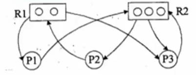

v2 记录

# 目录

## PDF

## Mp4

## 练习题

- 8/108 页码

[开始学习直播](#开始学习直播)

[开始学习录播](#开始学习录播)

- [11计算机硬件-cpu-校验码](#11计算机硬件-cpu-校验码)

- [12指令系统-存储系统-cache](#12指令系统-存储系统-cache)

----

### 开始学习直播

#### 00_1_24年5月直播课_更新中_考前复习看 > 01 .架构专题1.导学-选择题串讲1-24年5月

    ```
    先学习录播
    分层级结构学习，对于不重要内容可跳过
    重点 架构（八大架构）+ 构建 + 网络编程
    ```

### 开始学习录播

#### 01.新大纲_基础精讲新课_第二版

##### 1.1计算机硬件-CPU-校验码

- 计算机 运算器、控制器、存储器、输入设备和输出设备五大部件
- CPU（运算器 + 控制器）、存储器（内部存储 + 外部存储）、外设（输入设备 + 输出设备）
- CPU （运算器、控制器、寄存器组、内部总线 等部件）
- 运算器
  - 算术逻辑单元（ALU）实现对数据的算术和逻辑运算
  - 累加寄存器（AC）运算结果或源操作数的存放区
  - 数据缓冲寄存器（DR）暂时存放内存的指令或数据
  - 状态条件寄存器（SPW）保存指令运行结果的条件码内容
- 控制器
  - 指令寄存器（IR）暂存CPU执行指令
  - 程序计数器（PC）存放指令执行地址
  - 地址寄存器（AR）保存当前CPU所访问的内存地址
  - 指令译码器（ID）分析指令操作码
- CPU 依据 指令周期的不同阶段 来区分二进制的指令和数据
- 码距：在两个编码中，从一个编码到另一个编码所需要改变的位数 称为 码距。
- 奇偶校验码
  - 增加一位校验码来使编码中1的个数为奇数或者偶数。
  - 奇偶校验码 只能校验一位，不能纠错。
- CRC 校验码
  - 只能校验，不能纠错。
  - 需要先约定一个多项式(G(x)=x^5+x^2+x+1)，根据最高阶数 进行原始信息补零，根据多项式求得除数，除数 使用 模二 除法运算（不进位，不借位），求得余数。
  - 余数不足最高阶数，则余数左边用 若干零 补齐。

##### 1.2指令系统-存储系统-cache

- 指令系统
  - 指令的组成： 操作码 + 操作数
  - 操作码： 指明要完成的操作
  - 操作数： 指明参加运算的数据及其所在的单元地址
- 计算机指令执行过程
  - 取指令： 取出程序计数器PC中的指令地址
  - 分析指令：指令译码器进行分析，分析指令操作码
  - 执行指令： 执行指令，取出指令执行所需的源操作数  
- 指令寻址方式：
  - 顺序寻址方式： 一条接着一条指令 顺序执行
  - 跳跃寻址方式： 不是由程序计数器给出，而是由本条指令给出
- 指令操作数的寻址方式
  - 立即寻址方式： 指令的地址码字段指出的不是地址，而是操作数本身
  - 直接寻址方式： 在指令的地址字段中直接指出操作数在主存中的地址
  - 间接寻址方式： 指令地址码字段指向的存储单元中存储的是操作数的地址
  - 寄存器寻址方式： 指令中的地址码是寄存器的编号
- CISC 是复杂指令系统，兼容性强，指令繁多，长度可变，由微程序实现
- RISC 是精简指令系统，指令少，使用频率接近，主要依靠硬件实现（通用寄存器、硬布线逻辑控制）
- 指令流水线原理： 将指令分成不同段，每段由不同的部分去处理
- RISC 的流水线技术：
  - 超流水线技术： 细水长流，以时间换空间。
  - 超标量技术： 内装多条流水线，以空间换时间。
  - 超长指令字技术： 充分发挥软件的作用
- 流水线时间计算
  - 流水线周期： 指令分成不同执行段，其中执行时间最长的段为流水线周期
  - 流水线执行时间： 1条指令总执行时间+（总指令条数-1）*流水线周期
  - 流水线吞吐率计算： 指令条数/流水线执行时间
  - 流水线加速比计算： 不使用流水线执行时间/使用流水线执行时间
- 计算机采用分级存储体系的主要目的是为了解决存储容量、成本和速度之间的矛盾问题。
- 两级存储： Cache-主存、主存-辅存（虚拟存储体系）。
- 局部性原理：
  - 时间局部性：相邻的时间里会再次访问同一个数据项。
  - 空间局部性： 相邻的空间地址会被连续访问。
- 高速缓存Cache用来存储当前最活跃的程序和数据，直接与CPU交互。
- Cache 由控制部分和存储器组成。
- 地址映射：在CPU工作时，送出的是主存单元的地址，而应从Cache存储器中读/取信息。
  - 直接映射：Cache的每一个存储单元对应主存中的一个存储单元
  - 全相连映射： Cache的每一个存储单元对应主存中的多个存储单元
  - 组组相连映射： Cache的每一个组对应多个存储单元，组对应主存中的组概念
- 替换算法：当Cache已满，需要进行替换时，采用不同替换算法，使Cache 获得尽可能高的命中率。
  - 随机替换算法： 随机选择一个Cache块进行替换。
  - 先进先出算法： 按照顺序进行替换。
  - 近期最少使用算法： 选择近期最少使用的Cache块进行替换。
  - 优化替换算法： 需要先执行一次，更具统计情况 进行替换。
- 命中率及平均时间
  - 概念： 当CPU访问问的数据在Cache中时，成为Cache命中，直接从Cache中取出数据。
  - 平均访问时间 = 命中Cache概率 + 主存访问时间*（1-命中Cache概率）

##### 1.3磁盘-输入输出技术-总线

- 磁盘有正反两个盘面，每个盘面有多个同心圆，每个同心圆是一个磁道，每个同心圆又被划分为多个扇区，数据就被存放在一个个扇区中。
- 磁头 首先要寻找到对应的磁道，然后等待磁盘进行周期旋转，旋转到制定的扇区，才能读到对应的数据。
- 存取时间 = 寻道时间 + 等待时间
- 寻道时间：指磁头移动到磁道所需时间。
- 等待时间：指磁头转到等待读写的扇区下方所用的时间。
- 磁盘调度算法（寻道时间耗时最长）
  - 先来先服务：根据进程请求访问磁盘的先后顺序进行调度。
  - 最短寻道时间优先：请求访问的磁道与当前磁道最近的进程优先调度。
  - 扫描算法SCAN： 又称 电梯算法。
  - 单向扫描调度算法CSCAN：只做单向移动，只能从里向外活着从外向里。
- 计算机系统存在多种内存与接口地址的编制方法。
  - 内存与接口地址独立编址方式。
    - 内存地址和接口地址是完全独立的两个地址空间。
    - 缺点是用于接口的指令太少，功能太弱。
  - 内存与接口地址统一编址方法。
    - 内存地址和接口地址统一在一个公共的地址空间里，即内存单元和接口共用地址空间。
    - 优点是原则上用于内存的指令全都可以用于接口。
    - 缺点就在于整个地址空间被分成两部分。
- 计算机和外设间的数据交互方式
  - 程序控制（查询）方式：CPU主动查询外设是否完成数据传输，效率极低。
  - 程序中断方式： 外设完成数据库传输，向CPU发送中断，等待CPU处理数据，效率相对较高。
  - DMA方式（直接从主存存取）：CPU 只需要完成必要的初始化等操作，数据传输的整个过程都由DMA控制器来完成，在主存和外设之间建立直接的数据通路，效率很高。
  - 在一个总线周期结束后，CPU会响应DMA请求开始读取数据；CPU 响应程序中端方式请求是在一条指令执行结束时。
  - 总线：指计算机设备和设备之间传输信息的公共数据通道。
  - 广义上区分：内部总线，系统总线，外部总线。
  - 狭义上区分（系统总线 板级总线）：
    - 数据总线（并行数据传输位数）
    - 地址总线（系统可管理的内存空间的大小）
    - 控制总线（传送控制命令）

##### 2.1操作系统概述-进程管理-同步互斥

- 操作系统的三个作用
  - 管理计算机中运行的程序和分配各种软硬件资源
  - 为用户提供友善的人机界面
  - 为应用程序开发和运行提供一个高效率的平台
- 操作系统的4个特性 并发型、共享性、虚拟性和不确定性。
- 操作系统的功能
  - 进程管理
  - 文件管理
  - 存储管理
  - 设备管理
  - 作业管理
- 操作系统的分类
  - 批处理操作系统
  - 分时操作系统
  - 实时操作系统
  - 网络操作系统
    - 三种模式，集中模式、客户端\服务器模式、对等模式。
  - 分布式操作系统
  - 微型计算机操作系统
- 嵌入式操作系统主要特点
  - 微型化
  - 可定制
  - 实时性
  - 可靠性
  - 易移植性
- 嵌入式系统 初始化过程按照 自底向上、从硬件到软件的次序依次为：片级初始化> 板级初始化> 系统初始化.
- 进程的组成
  - 进程控制块（PCB）： 唯一标志
  - 程序： 描述进程要做什么
  - 数据： 存放进程执行时所需数据
- 进程基础状态三态图
    
- 前趋图： 任务间的并行，任务间的先后顺序。
    ！[img](./2.jpg)
- 进程资源图：用来表示进程和资源之间的分配和请求关系。
    
  - p 代表进程，R 代表资源
  - 阻塞节点： 所请求得资源已经全部分配完毕
  - 非阻塞节点： 所请求得资源还有剩余
  - 当一个进程资源图中 所有进程都是阻塞节点时，即陷入死锁。
- 临界资源: 各进程需要以互斥方式对其访问的资源。
- 临界区：指进程中对临界资源实施操作的那段程序。
- 互斥： 同一时间内只能由一个任务单独使用。
- 同步： 多个任务可以并发执行，只不过有速度上的差异。
- 互斥信号量： 对临界资源采用互斥访问，使用互斥信号量后其他进程无法访问，初始值为1.
- 同步信号量： 对共享资源的访问控制，初值一般是共享资源的数量。
- P操作： 申请资源，S= S-1
- V操作： 释放资源，S= S+1

##### 2.2进程调度-死锁-存储管理-固定分页分段

- 进程调度方式是指 当有更高优先级的进程到来时如何分配CPU。分为可剥夺和不可剥夺两种。
- 在某些操作系统中，一个作业从提交到完成需要经历高、中、低 三级调度。
  - 高级调度。处于输入池中那个后备作业可以调入主系统做好运行的准备。
  - 中级调度。处于交换区中那个就绪进程可以调入内存。
  - 低级调度。处于内存中的那个就绪进程可以占用CPU。
- 调度算法：
  - 先来先服务FCFS
  - 时间片轮转
  - 优先级调度
  - 多级反馈调度： 先按照优先级分为队列，每个队列分配不同时间片长度，进程没有完成降低优先级。
- 死锁
  - 死锁产生的四个必要条件：
    - 资源互斥
    - 每个进程占有资源并等待其他资源
    - 系统不能剥夺进程资源
    - 进程资源图是一个环路
  - 解决措施是打破四大条件
    - 死锁预防
    - 死锁避免
    - 死锁检测
    - 死锁解除
  - 死锁资源计算
    - 发生死锁最大资源数 = n*(R-1)
    - 不发生死锁最小资源数 = n*(R-1) + 1
- 进程：可拥有资源的独立单位；可独立调度和分配的基本单位。
  - 进程数目不已过多，切换频率不宜太高。
- 线程：调度和分配的基本单位，进程 独立分配资源的单位。
- 线程基本上不拥有资源，只拥有一点运行中必不可少的资源（程序计数器，一组寄存器和栈），可以与同属一个进程的其他线程共享进程所拥有的全部资源。
- 分区存储组织，就是整存，将某进程运行所需的内存整体一起分配给它。
  - 三种分区方式
    - 固定分区： 静态分区方法，会产生内部碎片。
    - 可变分区： 动态分区方法，会产生外部碎片。
  - 可重定位分区：可以解决碎片问题，移动分区。
    - 首次适应法
    - 最佳适应法
    - 最差适应法
    - 循环首次适应法
    
- 逻辑页 分为页号和业内地址
  - 优点： 利用率高，碎片小，分配及管理简单
  - 缺点： 增加了系统开销，可能产生抖动现象。
  - 页面置换算法
    - 最优算法：理论上的方法，没有实际意义。
    - 先进先出算法
    - 最近最少使用算法
  - 淘汰原则： 优先淘汰最近未访问的，而后淘汰最近未被修改的页。
  - 快表 是一块小容量的相连存储器，
    - 按内容访问，速度快，
    - 存放当前访问最频繁的少数活动页面的页号。
  - 快表是将页表存于Cache中；慢表是将页表存于内存上。
- 段
  - 每段也有段号和段内地址
  - 每段物理地址不同，分段式根据逻辑整体分段的，
  - 段表有段长和基址两个属性。
- 段页式
  - 对进程空间 先分段，后分页。

##### 2.3设备管理-文件管理

- 设备  
  - 是计算机系统与外界交互的工具，具体负责计算机与外部的输入/输出工作，所以常称为外部设备（简称外设）。
  - 设备分类
    - 按数据组织分类
    - 按设备功能分类
    - 资源分配角度分类
    - 数据传输速率分类
  - 设备管理任务 多个进程竞争使用设备时，按照一定策略分配和管理各种设备。
  - 设备主要功能 动态地掌握并记录设备的状态
  - 设备的层次结构
      
  - 设备管理技术 引入SPOOLING（外围设备联机技术）， 每个进程都感觉在使用一个打印机，这就是物理设备的虚拟化。  
- 文件
  - 文件是具有符号名的，在逻辑上具有完整意义的一组相关信息项的集合。
  - 信息项是构成文件内容的基本单位，一个文件包括文件体和文件说明。
  - 文件管理系统， 就是操作系统中 实现 文件 统一管理的一组软件和相关数据的集合，专门负责管理和存取文件信息的软件机构。
  - 文件的逻辑结构： 有结构的记录式文件 和 无结构的流式文件。
  - 文件的物理结构 是指 文件在物理存储设备上的存放方法。
    - 连续结构。将逻辑上连续的文件信息依次存放在连续编号的物理块上。
    - 链接结构。将逻辑上连续的文件信息存放在不连续的物理块上，每个物理块设有一个指针指向下一个物理块。
    - 索引结构。将逻辑上连续的文件信息存放在不连续的物理课上，索引表记录了文件信息所在的逻辑块号对应的物理块号。
    - 索引表式在文件创建时由紫铜自动建立的。
      - 直接索引，每个索引节点存放的是内容。
      - 一级间接索引， 存放链接到直接物理盘块的地址。
      - 二级间接索引，直接存放一级地址，一级地址再存放直接物理盘块地址，而后链接存放数据的物理盘块。
  - 文件控制块的有序集合称为文件目录
  - 相对路径： 是从当前路径开始的路径。
  - 绝对路径： 是从根路径开始的路径。
  - 全文件名 = 绝对路径+文件名。
  - 文件的存取方式是指读/写文件存储器上的一个物理块的方法。通常有顺序存取和随机存取。
  - 位示图。每一位对应文件存储器上的一个物理块，取值0和1 分别表示空闲和占用。

##### 3.1概述-三级模式-数据库设计-数据模型

- 三级模式： 外模式-模式（概念模式）-内模式
- 两级映像： 外模式-模式 和 模式-内模式
- 数据库设计
  - 需求分析 产出 数据流图，数据字典，需求说明书
  - 概念结构设计 产出 ER模型
  - 逻辑结构设计 产出 关系模型
  - 物理设计 产出 数据库表
  - 数据库实施阶段  
  - 数据库运行和维护阶段
- 关系模型 是 二维表的形式表示的实体-联系模型。
- 概念模型是从用户的角度进行建模的。
- 数据模型三要素：数据结构，数据操作，数据的完成性约束。
- 在E-R模型中，使用椭圆表示属性（一般没有），长方形表示实体，菱形表示联系，联系的两端要填写联系类型。
- 实体与弱实体，弱实体依赖实体。
- 实体: 客观存在并可相互区别的事物。
- 属性：实体所具有的特性。
- 联系： 事物内部以及事物之间的联系， 反映实体内部的联系和实体之间的关系。
- 联系类型： 一对一 1:1, 一对多 1:n， 多对多 m:n

-

##### 3.2关系代数-函数依赖-范式

- 关系代数
  - 并 u ：两张表中所有记录数合并，相同记录只显示一次
  - 交 n : 两张表中相同的记录
  - 差 - : s表中存在，t表中不存在的记录
  - 笛卡尔积 * : 两个集合的乘积，即两个组合所有可能的记录
  - 投影： 按照指定的属性列，从表中提取记录
  - 选择： 按照指定的行，从表中提取记录
  - 自然连接 ⨝：将两个表中相同属性相同值的数据组合新的表
- 函数依赖
  - 部分函数依赖： （A,B）中的一部分可以确定C
  - 传递函数依赖： A 可以确定 B， B 可以确定 C。
- 键与约束
  - 超键： 能唯一标识此表的属性的组合。
  - 候选键： 超键中去掉冗余的属性，剩余的属性就是候选键。
  - 主键： 任选一个候选键，即可为主键。
  - 外键：其他表中的主键。
  - 主属性：候选键内的属性为主属性，其他属性为非主属性。

  - 主键约束： 主键值不能为空，也不能重复。
  - 外键必须是其他表中已经存在的主键的值，或者为空。
- 范式
  - 第一范式： 每一个分量必须是一个不可分的数据项。
  - 第二范式： 建立在第一范式的基础上，每一个非主属性 不会依赖 复合主键中的某一个列。
  - 第三范式： 建立在第二范式的基础上，不存在非主属性对码的传递依赖。
  - BC范式： 在每一种情况下，每一个依赖的左边 决定因素都必然包含候选键。

##### 3.3模式分解-事务并发-封锁协议

- 模式分解
- 无损分解：当分解为两个关系模式，如果R的分解为p＝{R1, R2}, 无损分解, 充分必要条件是 R1 n R2->(R1-R2) 或者 R1 n R2-> (R2-R1).
- 并发控制
  - 事务
    - ACID 原子性、一致性、隔离性、持久性
    - 丢失更新、不可重复读、读脏数据
- 封锁协议
  - x锁是排它锁（写锁），其他事务都不能对A加任何类型的锁。
  - s锁是共享锁（读锁），其他事务可以加S锁，但布恩那个加x锁。

  - 一级封锁协议： 事务在修改数据R之前必须先对其加x锁，直到事务结束才释放，可解决丢失更新问题。
  - 二级封锁协议： 一级封锁协议基础上，加上事务T在 读数据R之前必须先对其加S锁，读完可释放S锁，解决丢失更新及读脏数据问题。
  - 三级封锁协议： 二级封锁协议基础上，要求事务在读取数据之前必须先对其加读锁，修改数据之前必须先对其加上写锁。三级可以结束丢失更新，读脏数据及不可重复读问题。

##### 3.4数据库新技术-SQL语言

- 数据库安全
  - 静态转储， 冷备份
  - 动态转储， 热备份
    - 完全备份：备份所有数据
    - 差量备份： 仅备份上一次完全备份后变化的数据。
    - 增量本分： 备份上一次备份之后变化的数据。
- 分片模式
  - 水平分片： 将表中水平的记录分别存放在不同的地方。
  - 垂直分片： 将表中垂直的列值分别存放在不同的地方。
- 分布透明性
  - 分片透明性： 用户或应用程序 不需要知道逻辑上访问的表具体是如何分块存储的。
  - 位置透明性： 应用程序不关心数据存储物理位置的改变。
  - 逻辑透明性： 用户或应用程序无需知道局部使用的是哪种数据模型。
  - 复制透明性： 用户或应用程序不关心复制的数据从何而来。

- 数据仓库 是一个 面向主题的，继承的，非易失的，且随时间变化的数据集合，用于支持管理决策。
- 数据仓库的结构通常包含四个层次。
  - 1. 数据库源
  - 2. 数据的存储与管理
  - 3. OLAP（联机分析处理）服务器。
  - 4. 前端工具  
- SQL　语言
  - 数据库查询 select ... from ... where;
  - 分组查询 group by
  - 更名运算 as
  - 字符串匹配 like, % 多个，_ 匹配任意一个
  - 数据库插入 insert into ... values()
  - 数据库删除 delete from ... where
  - 数据库修改 update ... set ... where
  - 排序 order by， 默认升序，降序 DESC  

##### 4.1嵌入式微处理器-多核处理器.嵌入式技术

- 冯.诺伊曼 结构，也称 普林斯顿结构，是一种将程序指令存储器和数据存储器合并在一起的存储器结构。

- 哈佛结构 是一种并行体系结构，将程序和数据存储在不同的存储空间中， 两个相互独立的存储器，每个存储器独立编址，独立访问。

- 两套独立的地址总线和数据总线。
- 一个机器周期内同时获取指令字（来自程序计数器）和操作数（来自数据存储器）。

- 根据嵌入式微处理器的字长宽度，可分为4位，8位，16...
- 按照用途分类，一般分为嵌入式 微控制器MCU，嵌入式微处理器MPU，嵌入式数字信号处理器DSP，嵌入式片上系统SOC等
  - 嵌入式 微控制器 MCU，典型代表　单片机，　是嵌入式系统工业的主流。
  - 嵌入式 微处理器 MPU，以最低的功耗和资源实现嵌入式应用的特殊要求。常见的arm， MIPS， POWER PC 等
  - 嵌入式数字信号处理器DSP，专门用于信号处理方面的处理器，　具有很高的编译效率和指令的执行速度。
  - 嵌入式片上系统SOC， 追求产品系统最大包容的集成器件。

- 多核指多个微处理器内核，是将两个或更多的微处理器封装在一起，集成在一个电路中。
  多核处理器是单枚芯片。多核与多CPU相比，很好的降低了计算机系统的功耗和体积。由操作系统软件进行调度，多进程，多线程并发都可以。

##### 4.2嵌入式软件-系统-RTOS-软件开发

- 嵌入式软件
  - 指 应用在嵌入式计算机系统当中的各种软件， 包括 规模较小，开发难度大，实时性和可靠性高，要求固化存储。
  - 分类
    - 系统软件，控制和管理嵌入式系统资源
    - 应用软件
    - 支撑软件，辅助软件开发的工具软件  
- 板级支持包（BSP） 介于主板硬件和操作系统中驱动层程序之间的一层。
- 特点
  - 硬件相关性
  - 操作系统相关性
  - BSP 主要包括两个方面的内容：引导加载程序 BootLoader 和 设备驱动程序。
  - BootLoader 是嵌入式系统加电后运行的第一段软件代码， 可以初始化硬件设备，建立内存空间的映射图，从而将系统的软硬件环境设置到一个合适的状态，以便最终调用操作系统内核做好准备。
  
  - 片级初始化： 主要完成微处理器的初始化，包括设置微处理器的核心寄存器，和控制寄存器，微处理器的核心工作模式及其局部总线等。
  - 板级初始化： 正确地设置各种寄存器的内容来完成微处理器以外的其他硬件设备的初始化。
  - 加载内核（系统初始化）： 将操作系统和应用程序的映像从Flash存储器复制到系统的内存当中。

#####

#####

#####

#####

#####

#####

#####

#####

#####

#####

#####

#####

#####

#####

#####

#####

#####

#####

#####

#####

#####

#####

#####

#####

#####

#####

#####

#####

#####

#####

#####

#####

#####

#####

#####

#####

#####

#####

#####

#####

#####

#####

#####

#####

#####

#####

#####

#####

#####

#####

#####

#####

#####

#####

#####

#####

#####

#####

#####

#####

#####

## [TOP](#目录)
