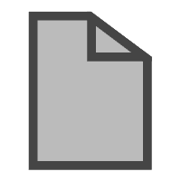

- 编程
  - Go 语言(Golang)编码规范 <a href ="https://www.bookstack.cn/read/go-code-convention/zh-CN-README.md">
  - [编写地道的 Go 代码](https://colobu.com/2017/02/07/write-idiomatic-golang-codes/)
  - [Go Code Review Comments](https://github.com/golang/go/wiki/CodeReviewComments#comment-sentences)
  - [Go 网络编程](https://drive.google.com/file/d/1QCzSDDWNUGNaRfR9hqkA0ldw_P3r66NE/view?usp=share_link)
  - [Go 语言编程](https://drive.google.com/file/d/1npe1PT4tU4Wr7SHvg7oUWS_djXJmMvNN/view?usp=share_link)
  - [Go 语言程序设计](https://drive.google.com/file/d/1eOdJB5hdXbJAO5CWQAzRW5VlM5RSYrRK/view?usp=share_link)
  - [Go 语言高级编程](https://drive.google.com/file/d/1Mmk9HG_w2yKEsZuQtyNvXM2ApouMOOLR/view?usp=share_link)
  - [GOLANG 修养之路 刘丹冰 Aceld](https://github.com/aceld/golang)
  - Golang中GC回收机制三色标记与混合写屏障 <a href ="https://www.bilibili.com/video/BV1wz4y1y7Kd">
  - Golang深入理解GPM模型 <a href ="https://www.bilibili.com/video/BV19r4y1w7Nx">
  - [轻量级 Django](https://drive.google.com/file/d/1bnPvkckYtK9op3lx9irCNqwKxuO8ozH5/view?usp=share_link)
  - [大话设计模式](https://drive.google.com/file/d/1vP3b8rDGsK1l2Hyd6u8cB38-ep06R6Pi/view?usp=share_link)
  - [MySQL 必知必会](https://drive.google.com/file/d/1BSZKOE8bBz1CNdoThuq8n047Fxl8hmgV/view?usp=share_link)
    - [笔记](./MySQL%20%E5%BF%85%E7%9F%A5%E5%BF%85%E4%BC%9A.md)
  - [PostgreSQL 数据库内核分析](https://drive.google.com/file/d/1cerWe56v6I_NZkAehNeDcBEM_A2_2WC8/view?usp=share_link)
  - [PostgreSQL 查询引擎源码探析](https://drive.google.com/file/d/1FYY-lQ-wpXUveheFwcVwDSiRo4RjGMea/view?usp=share_link)
  - [PostgreSQL 服务器编程](https://drive.google.com/file/d/1MX6c25JUVQk6_YYGj6oWQxWNZzl4DfLC/view?usp=share_link)
  - [PostgreSQL 修炼之道](https://drive.google.com/file/d/16trDa1a7JjhQeOADh6zXjclvk4x98M0M/view?usp=share_link)
  - [Redis 入门指南](https://drive.google.com/file/d/1RQhmA6eo0MEfIquLQtuyV22V5lsttmFZ/view?usp=share_link)
  - [Redis 设计与实现](https://drive.google.com/file/d/1ZUSueUEZ6YxfY391320B0HmXsq6vzqG1/view?usp=share_link)
  - [nginx 中文文档](https://www.nginx.cn/doc/)
  - [nginx 开发从入门到精通-淘宝核心组编写](http://tengine.taobao.org/book/)
  - [算法图解](https://drive.google.com/file/d/1z5nYj2hqyJFB3fDlaPHHh8bWKiGhTFmI/view?usp=drive_link)
    - [笔记](./%E7%AE%97%E6%B3%95%E5%9B%BE%E8%A7%A3%E7%AC%94%E8%AE%B0.md)
  - [程序员的职业素养](https://drive.google.com/file/d/1L4TTFnzsYidNuWaFAuVULnDwehHJxY4t/view?usp=share_link)
    - [笔记](./%E7%A8%8B%E5%BA%8F%E5%91%98%E7%9A%84%E8%81%8C%E4%B8%9A%E7%B4%A0%E5%85%BB%E7%AC%94%E8%AE%B0.md)
  - [程序员修炼之道](https://drive.google.com/file/d/1UtbbX2m4tLVLiP-6I9QAlE7X68mhraXm/view?usp=share_link)
  - [代码整洁之道](https://drive.google.com/file/d/1azuG5Ddo-2X0KHi_kCwkYitrYKGVKUpc/view?usp=share_link)
  - [Elasticsearch 大数据搜索引擎](https://drive.google.com/file/d/1idPzKsM5XqZf2pdZXB6RzadECS6o_5I4/view?usp=share_link)
  - [高效程序员的 45 个习惯](https://drive.google.com/file/d/1hSIeggu8AaOtya_vtMrm8Y_gpQB36c9O/view?usp=share_link)
  - [重构-改善既有代码的设计](https://drive.google.com/file/d/1Np3lTT0yeX0k47UQmFsjILs_6IZMxeWF/view?usp=share_link)
  - [人月神话](https://drive.google.com/file/d/1XwVRcPbRu1DmeLmBhIkHBbJgk8Bwk--q/view?usp=share_link)
  - [操作系统导论]
  - [计算机组成原理]
  - [算法导论]
  - [TCP/IP详解]
  - [UNIX网络编程]

- 系统
  - Linux 7.6 <a href ="https://www.bilibili.com/video/BV16Q4y1y7xS">
  - Kubernetes (K8S) 3 小时快速上手 + 实践 <a href ="https://www.bilibili.com/video/BV1Tg411P7EB">

- 其他

  - [天才向左疯子在右](https://drive.google.com/file/d/11pMWV9oRE3XRbwZjsL_Iu-WjxMC6tw5m/view?usp=share_link)
  - [只有偏执狂才能生存](https://drive.google.com/file/d/18ofd4ldbKKgCnv9rpuArfrXCOmhmBtWU/view?usp=share_link)
  - [在那西天取经的路上](https://drive.google.com/file/d/1r7R0-EX9SrC997f_-mK33uiVRNHlmSmW/view?usp=share_link)
  - [超级整理术](https://drive.google.com/file/d/1rBkNKJ1vuPEJhuv94l3F5dzkL_6Dz0Ad/view?usp=share_link)
  - [人间值得](https://drive.google.com/file/d/1iIO3Za-S9G90GMi7Z_h00WW-P6SdC3Zn/view?usp=share_link)

[笔记目录](../README.md)
