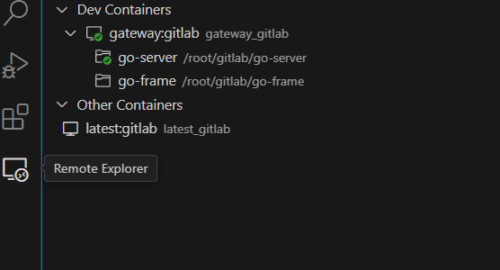

- 1. vscode 下载 [🔗](https://code.visualstudio.com/Download)

- 2. 插件安装(建议使用 VPN 安装)

- 3. 设置-配置调整（settings.json）

  - 3.1 设置代理

    ```
       settings.json 增加配置：
       "http.proxy": "http://127.0.0.1:7890",
       "http.proxyStrictSSL": false
       终端输入：
       git config  http.sslVerify false
       git config  http.proxy http://127.0.0.1:7890
    ```

- 4. launch.json 微调整, 用于代码运行断点调试 [🔗](./launch.json)

- 5. Go 版本建议 1.19+ [🔗](https://golang.google.cn/dl/)

- 6. Remote 远程开发
  - 6.1 Remote Development 相关插件安装
  - 6.2 点击左下角 SSH -> Remote SSH -> + Add New SSH HOST.. -> 页面 启动 打开文件夹
  - 6.3 本地部分插件无法使用需要在远程服务器上进行安装

- 7. settings.json 配置 [🔗](./settings.json)
- 插件集合
  - VsCode+WSL+Docker 开发环境构建指南

    [Docker Install](https://www.runoob.com/docker/windows-docker-install.html)

    [WSL 2.0 Install](https://blog.csdn.net/hjb2722404/article/details/120738062)

    [VsCode Install](https://www.runoob.com/w3cnote/vscode-tutorial.html)

    [Docker Image Build]()

    - 构建镜像

      dingms 镜像参考 <https://hub.docker.com/r/dingms/ucas-bdms-hw-u64-2019> 该镜像包含大数据开发使用到的常见环境

      推荐自己构建镜像 <https://www.runoob.com/w3cnote/docker-use-container-create-image.html>

    - 挂载启动镜像

      docker run -it -v 本地文件夹:容器文件夹 容器名称 镜像名称:镜像tag

    - Vscode 安装插件

      

      - Remote Development

      - Dev Containers

  - code-profile [🔗](./vs-config.code-profile)

[应用集合](../readme.md)
